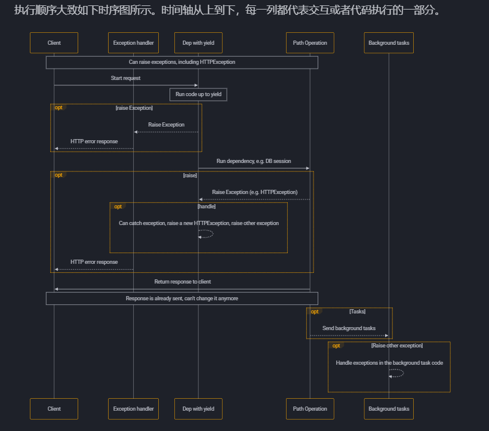

## 一、概念

### 1.`fastapi`概念

> `FastAPI` 是一个用于构建 `API` 的现代、快速（高性能）的 web 框架，使用 Python 并基于标准的 Python 类型提示

**关键特性**:

- **快速**：可与 **`NodeJS`** 和 **Go** 并肩的极高性能（归功于 `Starlette` 和` Pydantic`）。最快的 Python web 框架之一。
- **高效编码**：提高功能开发速度约 200％ 至 300％。*
- **更少 bug**：减少约 40％ 的人为（开发者）导致错误。*
- **智能**：极佳的编辑器支持。处处皆可自动补全，减少调试时间。
- **简单**：设计的易于使用和学习，阅读文档的时间更短。
- **简短**：使代码重复最小化。通过不同的参数声明实现丰富功能。bug 更少。
- **健壮**：生产可用级别的代码。还有自动生成的交互式文档。
- **标准化**：基于（并完全兼容）`API` 的相关开放标准：[`OpenAPI`](https://github.com/OAI/OpenAPI-Specification) (以前被称为 Swagger) 和 [`JSON Schema`](https://json-schema.org/) (以前被称为 Swagger) 和 [`JSON Schema`](https://json-schema.org/)。

### 2.`starlette`概念

> `Starlette `是一个轻量级的 **异步 Web 框架**，为 `FastAPI `提供底层支持。它专注于处理 HTTP 请求/响应、`WebSocket `通信和中间件功能，是 `FastAPI `的“地基”

**核心特性**：

- **异步支持**：基于 Python 的 `async/await` 语法，支持高并发场景（如处理大量并发请求或实时通信）。
- **路由系统**：提供直观的路径操作装饰器（如 `@app.get()`），定义 `API `端点。
- **请求与响应处理**：内置对 `JSON`、表单数据等格式的支持。
- **中间件**：允许在请求处理前后添加自定义逻辑（如日志记录、身份验证）。
- **`WebSocket `支持**：支持实时双向通信，适用于聊天应用、实时数据推送等场景

**示例**：

```python
from starlette.applications import Starlette
from starlette.responses import JSONResponse
from starlette.routing import Route

async def homepage(request):
    return JSONResponse({"message": "欢迎使用 Starlette!"})

async def user(request):
    user_id = request.path_params["user_id"]
    return JSONResponse({"user_id": user_id})

app = Starlette(debug=True, routes=[
    Route("/", homepage),
    Route("/user/{user_id:int}", user),
])

# 启动方式：uvicorn script_name:app --reload
```

### 3.`pydantic`概念

> Pydantic 是一个 **数据验证和解析库**，用于定义数据模型、校验输入输出数据，并自动生成文档。它是 FastAPI 数据处理的核心工具

**核心特性**：

- **数据验证**：通过类型注解自动校验数据（如字符串、数字、嵌套对象）。
- **数据解析**：将 JSON、字典等原始数据转换为 Python 对象。
- **自动生成文档**：结合 FastAPI 生成 OpenAPI/Swagger 文档。
- **配置管理**：支持从环境变量或配置文件加载数据

**示例**：

```python
from pydantic import BaseModel, Field

class Item(BaseModel):
    name: str
    price: float = Field(gt=0, description="价格必须大于0")
    description: str | None = None

# 使用示例
data = {"name": "苹果", "price": "1.99", "description": "新鲜水果"}
item = Item(**data)
print(item.price)  # 自动转换为 float: 1.99
```

## 二、核心使用

### 2.1 路由参数

> 通过app.method 注册路由，method支持【get post put delete 】

**示例**:

```python
from fastapi import FastAPI

app = FastAPI()


@app.get("/items/{item_id}")
async def read_item(item_id):
    return {"item_id": item_id}
```

#### 2.1.1 不声明默认str

```python
@app.get("/users/test/{user_id}")
async def test(user_id):
    print(type(user_id))
    return {"message": "Hello World"}
```

#### 2.1.2 声明类型

> 支持str int

```python
from fastapi import FastAPI

app = FastAPI()

@app.get("/items/{item_id}")
async def read_item(item_id: int):
    return {"item_id": item_id}
```

#### 2.1.3 路径参数

> /files/{file_path:path}

```
from fastapi import FastAPI

app = FastAPI()

@app.get("/files/{file_path:path}")
async def read_file(file_path: str):
    return {"file_path": file_path}
```

#### 2.1.4 预设值

> 使用Python 的 `Enum` 类型接收预设的*路径参数*

```python
from enum import Enum

from fastapi import FastAPI


class ModelName(str, Enum):
    alexnet = "alexnet"
    resnet = "resnet"
    lenet = "lenet"

app = FastAPI()


@app.get("/models/{model_name}")
async def get_model(model_name: ModelName):
    if model_name is ModelName.alexnet:
        return {"model_name": model_name, "message": "Deep Learning FTW!"}

    if model_name.value == "lenet":
        return {"model_name": model_name, "message": "LeCNN all the images"}

    return {"model_name": model_name, "message": "Have some residuals"}
```

#### 2.1.5 参数校验

> 使用Path，下面是可以声明的参数校验
>
> - `gt`：大于（`g`reater `t`han）
> - `ge`：大于等于（`g`reater than or `e`qual）
> - `lt`：小于（`l`ess `t`han）
> - `le`：小于等于（`l`ess than or `e`qual）

```python
from fastapi import FastAPI, Path

app = FastAPI()

# 是用* 对python没有任何意义，但是q没有默认值可以放到后面
@app.get("/items/{item_id}")
async def read_items(*, item_id: int = Path(title="The ID of the item to get"), q: str):
    results = {"item_id": item_id}
    if q:
        results.update({"q": q})
    return results
```

#### 2.1.6 路径操作配置

- `status_code`：`status_code` 用于定义*路径操作*响应中的 HTTP 状态码

- `tags` 参数：`tags` 用于为*路径操作*添加标签，进行接口分类

- `summary` 和 `description`：添加对路径的描述

- operation_id参数：指定唯一ID

- include_in_schema参数：设置False不在doc中显示

- docstring 的高级描述

  ```
  from typing import Set, Union
  
  from fastapi import FastAPI
  from pydantic import BaseModel
  
  app = FastAPI()
  
  
  class Item(BaseModel):
      name: str
      description: Union[str, None] = None
      price: float
      tax: Union[float, None] = None
      tags: Set[str] = set()
  
  
  @app.post("/items/", response_model=Item, summary="Create an item")
  async def create_item(item: Item):
      """
      Create an item with all the information:
  
      - **name**: each item must have a name
      - **description**: a long description
      - **price**: required
      - **tax**: if the item doesn't have tax, you can omit this
      - **tags**: a set of unique tag strings for this item
      \f
      :param item: User input.
      """
      return item
  ```

  

### 2.2 查询参数

#### 2.2.1 默认参数

> 视图函数中参数设置默认值

```python
from fastapi import FastAPI

app = FastAPI()

fake_items_db = [{"item_name": "Foo"}, {"item_name": "Bar"}, {"item_name": "Baz"}]


@app.get("/items/")
async def read_item(skip: int = 0, limit: int = 10):
    return fake_items_db[skip : skip + limit]
```

#### 2.2.2 可选参数

> 参数设置none

```python
from fastapi import FastAPI

app = FastAPI()


@app.get("/items/{item_id}")
async def read_item(item_id: str, q: str | None = None):
    if q:
        return {"item_id": item_id, "q": q}
    return {"item_id": item_id}
```

#### 2.2.3 字符串校验

> 使用Query 

**使用示例**

```python
from typing import Union

from fastapi import FastAPI, Query

app = FastAPI()


@app.get("/items/")
async def read_items(q: Union[str, None] = Query(default=None, max_length=50)):
    results = {"items": [{"item_id": "Foo"}, {"item_id": "Bar"}]}
    if q:
        results.update({"q": q})
    return results
```

**Query 支持的参数**

```python
 Query(
    default: Any = Undefined,
    *,
    default_factory: (() -> Any) | None = _Unset,
    alias: str | None = None,
    alias_priority: int | None = _Unset,
    validation_alias: str | None = None,
    serialization_alias: str | None = None,
    title: str | None = None,
    description: str | None = None,
    gt: float | None = None,
    ge: float | None = None,
    lt: float | None = None,
    le: float | None = None,
    min_length: int | None = None,
    max_length: int | None = None,
    pattern: str | None = None,
    regex: str | None = None,
    discriminator: str | None = None,
    strict: bool | None = _Unset,
    multiple_of: float | None = _Unset,
    allow_inf_nan: bool | None = _Unset,
    max_digits: int | None = _Unset,
    decimal_places: int | None = _Unset,
    examples: List[Any] | None = None,
    example: Any | None = _Unset,
    openapi_examples: Dict[str, Example] | None = None,
    deprecated: deprecated | str | bool | None = None,
    include_in_schema: bool = True,
    json_schema_extra: Dict[str, Any] | None = None,
    **extra: Any
) -> Any
```

#### 2.2.4 查询参数多个值

> 如果设置一个同一个参数多个值，像这样http://localhost:8000/items/?q=foo&q=bar

```python
from typing import List, Union

from fastapi import FastAPI, Query

app = FastAPI()


@app.get("/items/")
async def read_items(q: Union[List[str], None] = Query(default=None)):
    query_items = {"q": q}
    return query_items
```

**题外话**：

> Query 和Path都继承于一个共同的 `Param` 类（不需要直接调用它）
>
> 当你导入Query和Path 的时候都是导入的函数，调用的时候会自动返回实例对象

#### 2.2.5 使用参数模型

> 在一个 **Pydantic 模型**中声明你需要的**查询参数**，然后将参数声明为 `Query`

```python
from typing import Annotated, Literal

from fastapi import FastAPI, Query
from pydantic import BaseModel, Field

app = FastAPI()


class FilterParams(BaseModel):
    model_config = {"extra": "forbid"} # 禁止其它额外参数

    limit: int = Field(100, gt=0, le=100) #设置默认值和参数校验
    offset: int = Field(0, ge=0)
    order_by: Literal["created_at", "updated_at"] = "created_at" #枚举
    tags: list[str] = []


@app.get("/items/")
async def read_items(filter_query: Annotated[FilterParams, Query()]):
    return filter_query
```


### 2.3 请求体

> 仅使用 Python 类型声明，**FastAPI** 就可以：
>
> - 以 JSON 形式读取请求体
> - （在必要时）把请求体转换为对应的类型
> - 校验数据：
>   - 数据无效时返回错误信息，并指出错误数据的确切位置和内容
> - 把接收的数据赋值给参数item
>   - 把函数中请求体参数的类型声明为 `Item`，还能获得代码补全等编辑器支持
> - 为模型生成 JSON Schema，在项目中所需的位置使用
> - 这些概图是 OpenAPI 概图的部件，用于 API 文档 UI

#### 2.3.1 简单使用

> 基于`pydantic`的BaseModel构建请求体，然后再函数中使用，支持默认值和类型

```python
from fastapi import FastAPI
from pydantic import BaseModel


class Item(BaseModel):
    name: str
    description: str | None = None
    price: float
    tax: float | None = None


app = FastAPI()


@app.post("/items/")
async def create_item(item: Item):
    return item
```

#### 2.3.2 路径参数，查询参数和请求体混用

> 请求接口 http:/localhost:8888/items/10?q=111
>
> 请求体json参数
>
> ```python
> {
>     "name": "Foo",
>     "description": "The pretender",
>     "price": 42.0,
>     "tax": 3.2
> }
> ```
>
> 

```python
from typing import Annotated

from fastapi import FastAPI, Path
from pydantic import BaseModel

app = FastAPI()


class Item(BaseModel):
    name: str
    description: str | None = None
    price: float
    tax: float | None = None


@app.put("/items/{item_id}")
async def update_item(
    item_id: Annotated[int, Path(title="The ID of the item to get", ge=0, le=1000)],
    q: str | None = None,
    item: Item | None = None,
):
    results = {"item_id": item_id}
    if q:
        results.update({"q": q})
    if item:
        results.update({"item": item})
    return results
```

#### 2.3.4 多个请求体参数一起用

>请求体参数
>
>```python
>{
>    "item": {
>        "name": "Foo",
>        "description": "The pretender",
>        "price": 42.0,
>        "tax": 3.2
>    },
>    "user": {
>        "username": "dave",
>        "full_name": "Dave Grohl"
>    }
>}
>```


```python
from fastapi import FastAPI
from pydantic import BaseModel

app = FastAPI()


class Item(BaseModel):
    name: str
    description: str | None = None
    price: float
    tax: float | None = None


class User(BaseModel):
    username: str
    full_name: str | None = None


@app.put("/items/{item_id}")
async def update_item(item_id: int, item: Item, user: User):
    results = {"item_id": item_id, "item": item, "user": user}
    return results
```

#### 2.3.5 请求体单一值

> 通过`Body`实现
>
> 希望的请求体：
>
> ```python
> {
>     "item": {
>         "name": "Foo",
>         "description": "The pretender",
>         "price": 42.0,
>         "tax": 3.2
>     },
>     "user": {
>         "username": "dave",
>         "full_name": "Dave Grohl"
>     },
>     "importance": 5
> }
> ```


```PYTHON
from typing import Annotated

from fastapi import Body, FastAPI
from pydantic import BaseModel

app = FastAPI()


class Item(BaseModel):
    name: str
    description: str | None = None
    price: float
    tax: float | None = None


class User(BaseModel):
    username: str
    full_name: str | None = None


@app.put("/items/{item_id}")
async def update_item(
    item_id: int, item: Item, user: User, importance: Annotated[int, Body()]
):
    results = {"item_id": item_id, "item": item, "user": user, "importance": importance}
    return results
```

#### 2.3.6 嵌入单个请求体参数

>在请求模型里面使用Body，会在请求JSON参数外面加一层
>
>```python
>{
>    "item": {
>        "name": "Foo",
>        "description": "The pretender",
>        "price": 42.0,
>        "tax": 3.2
>    }
>}
>```


```python
from typing import Annotated

from fastapi import Body, FastAPI
from pydantic import BaseModel

app = FastAPI()


class Item(BaseModel):
    name: str
    description: str | None = None
    price: float
    tax: float | None = None


@app.put("/items/{item_id}")
async def update_item(item_id: int, item: Annotated[Item, Body(embed=True)]):
    results = {"item_id": item_id, "item": item}
    return results
```

#### 2.3.7 请求体模型嵌套

##### 1.使用自带类型

> 嵌套不使用额外子模型
>
> 希望请求体参数
>
> ```
> {
>     "name": "Foo",
>     "description": "The pretender",
>     "price": 42.0,
>     "tax": 3.2,
>     "tags": ["rock", "metal", "bar"]
> }
> ```
>
> 

```python
from fastapi import FastAPI
from pydantic import BaseModel

app = FastAPI()


class Item(BaseModel):
    name: str
    description: str | None = None
    price: float
    tax: float | None = None
    tags: list[str] = []


@app.put("/items/{item_id}")
async def update_item(item_id: int, item: Item):
    results = {"item_id": item_id, "item": item}
    return results
```

##### 2.使用子模型

> 在模型参数中使用其它模型
>
> 希望的请求体参数
>
> ```python
> {
>     "name": "Foo",
>     "description": "The pretender",
>     "price": 42.0,
>     "tax": 3.2,
>     "tags": ["rock", "metal", "bar"],
>     "image": {
>         "url": "http://example.com/baz.jpg",
>         "name": "The Foo live"
>     }
> }
> ```

```python
from fastapi import FastAPI
from pydantic import BaseModel

app = FastAPI()


class Image(BaseModel):
    url: str
    name: str


class Item(BaseModel):
    name: str
    description: str | None = None
    price: float
    tax: float | None = None
    tags: set[str] = set()
    image: Image | None = None


@app.put("/items/{item_id}")
async def update_item(item_id: int, item: Item):
    results = {"item_id": item_id, "item": item}
    return results
```


### 2.4 模型的额外设置

#### 2.4.1 添加额外信息

> 您可以在JSON模式中定义额外的信息，一个常见的用例是添加一个将在文档中显示的`example`

- 通过model_config 设置

  ```python
  from fastapi import FastAPI
  from pydantic import BaseModel
  
  app = FastAPI()
  
  
  class Item(BaseModel):
      name: str
      description: str | None = None
      price: float
      tax: float | None = None
  
      model_config = {
          "json_schema_extra": {
              "examples": [
                  {
                      "name": "Foo",
                      "description": "A very nice Item",
                      "price": 35.4,
                      "tax": 3.2,
                  }
              ]
          }
      }
  
  
  @app.put("/items/{item_id}")
  async def update_item(item_id: int, item: Item):
      results = {"item_id": item_id, "item": item}
      return results
  ```

  

- 通过Feild设置

  > 在 `Field`, `Path`, `Query`, `Body` 和其他你之后将会看到的工厂函数，你可以为JSON 模式声明额外信息，你也可以通过给工厂函数传递其他的任意参数来给JSON 模式声明额外信息，比如增加 `example`，注意：传递的那些额外参数不会添加任何验证，只会添加注释，用于文档的目的

  ```python
  from fastapi import FastAPI
  from pydantic import BaseModel, Field
  
  app = FastAPI()
  
  
  class Item(BaseModel):
      name: str = Field(examples=["Foo"])
      description: str | None = Field(default=None, examples=["A very nice Item"])
      price: float = Field(examples=[35.4])
      tax: float | None = Field(default=None, examples=[3.2])
  
  
  @app.put("/items/{item_id}")
  async def update_item(item_id: int, item: Item):
      results = {"item_id": item_id, "item": item}
      return results
  ```

  

- 通过Body设置

  > 你可以通过传递额外信息给 `Field` 同样的方式操作`Path`, `Query`, `Body`等

  ```python
  from typing import Annotated
  
  from fastapi import Body, FastAPI
  from pydantic import BaseModel
  
  app = FastAPI()
  
  
  class Item(BaseModel):
      name: str
      description: str | None = None
      price: float
      tax: float | None = None
  
  
  @app.put("/items/{item_id}")
  async def update_item(
      item_id: int,
      item: Annotated[
          Item,
          Body(
              examples=[
                  {
                      "name": "Foo",
                      "description": "A very nice Item",
                      "price": 35.4,
                      "tax": 3.2,
                  }
              ],
          ),
      ],
  ):
      results = {"item_id": item_id, "item": item}
      return results
  ```

#### 2.4.2 额外的数据类型

- **常见的数据类型**

  - `int`
  - `float`
  - `str`
  - `bool`

- **额外的数据类型**

  - **UUID**:
    - 一种标准的 "通用唯一标识符" ，在许多数据库和系统中用作ID。
    - 在请求和响应中将以 `str` 表示。
  - **datetime.datetime**:
    - 一个 Python `datetime.datetime`.
    - 在请求和响应中将表示为 ISO 8601 格式的 `str` ，比如: `2008-09-15T15:53:00+05:00`.
  - **datetime.date**:
    - Python `datetime.date`.
    - 在请求和响应中将表示为 ISO 8601 格式的 `str` ，比如: `2008-09-15`.
  - **datetime.time**:
    - 一个 Python `datetime.time`.
    - 在请求和响应中将表示为 ISO 8601 格式的 `str` ，比如: `14:23:55.003`.
  - **datetime.timedelta**:
    - 一个 Python `datetime.timedelta`.
    - 在请求和响应中将表示为 `float` 代表总秒数。
    - Pydantic 也允许将其表示为 "ISO 8601 时间差异编码"
  - **frozenset**:
    - 在请求和响应中，作为set对待：
    - 在请求中，列表将被读取，消除重复，并将其转换为一个 `set`。
    - 在响应中 `set` 将被转换为 `list` 。
    - 产生的模式将指定那些 `set` 的值是唯一的 (使用 JSON 模式的 `uniqueItems`)。
  - **bytes**:
    - 标准的 Python `bytes`。
    - 在请求和响应中被当作 `str` 处理。
    - 生成的模式将指定这个 `str` 是 `binary` "格式"。
  - **Decimal**:
    - 标准的 Python `Decimal`。
    - 在请求和响应中被当做 `float` 一样处理。
  - 可以在这里检查所有有效的pydantic数据类型: [Pydantic data types](https://docs.pydantic.dev/latest/concepts/types/).

  **示例**

  ```python
  from datetime import datetime, time, timedelta
  from typing import Annotated
  from uuid import UUID
  
  from fastapi import Body, FastAPI
  
  app = FastAPI()
  
  
  @app.put("/items/{item_id}")
  async def read_items(
      item_id: UUID,
      start_datetime: Annotated[datetime, Body()],
      end_datetime: Annotated[datetime, Body()],
      process_after: Annotated[timedelta, Body()],
      repeat_at: Annotated[time | None, Body()] = None,
  ):
      start_process = start_datetime + process_after
      duration = end_datetime - start_process
      return {
          "item_id": item_id,
          "start_datetime": start_datetime,
          "end_datetime": end_datetime,
          "process_after": process_after,
          "repeat_at": repeat_at,
          "start_process": start_process,
          "duration": duration,
      }
  ```

### 2.5 cookie参数

>在 **Pydantic 模型**中声明所需的 **header 参数**，然后将参数声明为 `Cookie`

```python
from typing import Annotated

from fastapi import Cookie, FastAPI
from pydantic import BaseModel

app = FastAPI()


class Cookies(BaseModel):
    session_id: str
    fatebook_tracker: str | None = None
    googall_tracker: str | None = None


@app.get("/items/")
async def read_items(cookies: Annotated[Cookies, Cookie()]):
    return cookies
```


### 2.6 header参数

> 在 **Pydantic 模型**中声明所需的 **header 参数**，然后将参数声明为 `Header`

```python
from typing import Annotated

from fastapi import FastAPI, Header
from pydantic import BaseModel

app = FastAPI()


class CommonHeaders(BaseModel):
    host: str
    save_data: bool
    if_modified_since: str | None = None
    traceparent: str | None = None
    x_tag: list[str] = []


@app.get("/items/")
async def read_items(headers: Annotated[CommonHeaders, Header()]):
    return headers
```

### 2.7 响应模型

> @app.post("/items/", response_model=Item) 使用*路径操作装饰器*的 `response_model` 参数来定义响应模型，特别是确保私有数据被过滤掉
>
> 使用 `response_model_exclude_unset` 来仅返回显式设定的值

#### 2.7.1 返回显式设定的值

```python
from typing import Any

from fastapi import FastAPI
from pydantic import BaseModel

app = FastAPI()

class Item(BaseModel):
    name: str
    description: str | None = None
    price: float
    tax: float | None = None
    tags: list[str] = []


@app.post("/items/", response_model=Item)
async def create_item(item: Item) -> Any:
    return item


@app.get("/items/", response_model=list[Item])
async def read_items() -> Any:
    return [
        {"name": "Portal Gun", "price": 42.0},
        {"name": "Plumbus", "price": 32.0},
    ]
```

#### **2.7.2 设置默认响应参数**：

```python
from typing import List, Union

from fastapi import FastAPI
from pydantic import BaseModel

app = FastAPI()


class Item(BaseModel):
    name: str
    description: Union[str, None] = None
    price: float
    tax: float = 10.5
    tags: List[str] = []


items = {
    "foo": {"name": "Foo", "price": 50.2},
    "bar": {"name": "Bar", "description": "The bartenders", "price": 62, "tax": 20.2},
    "baz": {"name": "Baz", "description": None, "price": 50.2, "tax": 10.5, "tags": []},
}


@app.get("/items/{item_id}", response_model=Item, response_model_exclude_unset=True)
async def read_item(item_id: str):
    return items[item_id]
```

#### 2.7.3 **额外的状态码**

```python
from typing import Union

from fastapi import Body, FastAPI, status
from fastapi.responses import JSONResponse

app = FastAPI()

items = {"foo": {"name": "Fighters", "size": 6}, "bar": {"name": "Tenders", "size": 3}}


@app.put("/items/{item_id}")
async def upsert_item(
    item_id: str,
    name: Union[str, None] = Body(default=None),
    size: Union[int, None] = Body(default=None),
):
    if item_id in items:
        item = items[item_id]
        item["name"] = name
        item["size"] = size
        return item
    else:
        item = {"name": name, "size": size}
        items[item_id] = item
        return JSONResponse(status_code=status.HTTP_201_CREATED, content=item)
```

#### 2.7.4 自动转换所有数据类型：

> 如果不首先将 Pydantic 模型转换为 `dict`，并将所有数据类型（如 `datetime`、`UUID` 等）转换为兼容 JSON 的类型，则不能将其放入JSONResponse中。
>
> 对于这些情况，在将数据传递给响应之前，你可以使用 `jsonable_encoder` 来转换你的数据

```python
from datetime import datetime
from typing import Union

from fastapi import FastAPI
from fastapi.encoders import jsonable_encoder
from fastapi.responses import JSONResponse
from pydantic import BaseModel


class Item(BaseModel):
    title: str
    timestamp: datetime
    description: Union[str, None] = None


app = FastAPI()


@app.put("/items/{id}")
def update_item(id: str, item: Item):
    json_compatible_item_data = jsonable_encoder(item)
    return JSONResponse(content=json_compatible_item_data)
```

#### 2.7.5 **返回自定义response**

> 上面的例子展示了需要的所有部分，但还不够实用，因为你本可以只是直接返回 `item`，而**FastAPI** 默认帮你把这个 `item` 放到 `JSONResponse` 中，又默认将其转换成了 `dict`等等
>
> 下面返回xml

```python
from fastapi import FastAPI, Response

app = FastAPI()


@app.get("/legacy/")
def get_legacy_data():
    data = """<?xml version="1.0"?>
    <shampoo>
    <Header>
        Apply shampoo here.
    </Header>
    <Body>
        You'll have to use soap here.
    </Body>
    </shampoo>
    """
    return Response(content=data, media_type="application/xml")
```


### 2.8 Form 表单

> 要使用Form

**不使用模型**：

```python
from fastapi import FastAPI, Form

app = FastAPI()


@app.post("/login/")
async def login(username: str = Form(), password: str = Form()):
    return {"username": username}
```

**使用模型参数**：

```python
from typing import Annotated

from fastapi import FastAPI, Form
from pydantic import BaseModel

app = FastAPI()


class FormData(BaseModel):
    username: str
    password: str


@app.post("/login/")
async def login(data: Annotated[FormData, Form()]):
    return data
```

### 2.9 文件上传

> 需要安裝pip install python-multipart，使用 `File` 和 `UploadFile`

```python
from fastapi import FastAPI, File, UploadFile

app = FastAPI()


@app.post("/files/")
async def create_file(file: bytes = File()):
    return {"file_size": len(file)}


@app.post("/uploadfile/")
async def create_upload_file(file: UploadFile):
    return {"filename": file.filename}
```

**File和uploadFile区别**：

- **`File`**
  - 仅提供基础的文件读取功能（返回 `bytes` 或 `str`）。
  - 不支持获取文件元数据（如文件名、MIME 类型）。
- **`UploadFile`**
  - 提供丰富的属性和方法：
    - **属性**：
      - `filename`: 上传文件的原始文件名（字符串）。
      - `content_type`: 文件的 MIME 类型（如 `image/jpeg`）。
      - `file`: 底层的 `SpooledTemporaryFile` 对象（可传递给其他库处理）。
    - **方法**：
      - `read(size)`: 按指定字节数读取文件内容。
      - `seek(offset)`: 移动文件指针位置（如重新读取文件）。
      - `write(data)`: 向文件写入数据。
  - 支持异步操作（如 `await file.read()`），适合处理大文件

### 2.10 form表单和文件上传

> 同时多个参数

```python
from fastapi import FastAPI, File, Form, UploadFile

app = FastAPI()


@app.post("/files/")
async def create_file(
    fileb: UploadFile = File(), token: str = Form()
):
    return {
        "token": token,
        "fileb_content_type": fileb.content_type,
    }
```

### 2.11 错误处理

#### 2.11.1 使用 `HTTPException`

> 如在调用*路径操作函数*里的工具函数时，触发了 `HTTPException`，FastAPI 就不再继续执行*路径操作函数*中的后续代码，而是立即终止请求，并把 `HTTPException` 的 HTTP 错误发送至客户端

```python
from fastapi import FastAPI, HTTPException

app = FastAPI()

items = {"foo": "The Foo Wrestlers"}


@app.get("/items/{item_id}")
async def read_item(item_id: str):
    if item_id not in items:
        raise HTTPException(status_code=404, detail="Item not found")
    return {"item": items[item_id]}
```

#### 2.11.2 添加自定义响应头

> 有些场景下要为 HTTP 错误添加自定义响应头。例如，出于某些方面的安全需要。
>
> 一般情况下可能不会需要在代码中直接使用响应头。
>
> 但对于某些高级应用场景，还是需要添加自定义响应头

```python
from fastapi import FastAPI, HTTPException

app = FastAPI()

items = {"foo": "The Foo Wrestlers"}


@app.get("/items-header/{item_id}")
async def read_item_header(item_id: str):
    if item_id not in items:
        raise HTTPException(
            status_code=404,
            detail="Item not found",
            headers={"X-Error": "There goes my error"},
        )
    return {"item": items[item_id]}
```

#### 2.11.3 自定义异常处理

> `@app.exception_handler()` 添加自定义异常控制器，需要先自定义一个异常类，中途自己抛出，然后用app.exception_handler()接收

```python
from fastapi import FastAPI, Request
from fastapi.responses import JSONResponse


class UnicornException(Exception):
    def __init__(self, name: str):
        self.name = name


app = FastAPI()


@app.exception_handler(UnicornException)
async def unicorn_exception_handler(request: Request, exc: UnicornException):
    return JSONResponse(
        status_code=418,
        content={"message": f"Oops! {exc.name} did something. There goes a rainbow..."},
    )


@app.get("/unicorns/{name}")
async def read_unicorn(name: str):
    if name == "yolo":
        raise UnicornException(name=name)
    return {"unicorn_name": name}
```

#### 2.11.4复合式api异常处理

> FastAPI 支持先对异常进行某些处理，然后再使用 **FastAPI** 中处理该异常的默认异常处理器

```python
from fastapi import FastAPI, HTTPException
from fastapi.exception_handlers import (
    http_exception_handler,
    request_validation_exception_handler,
)
from fastapi.exceptions import RequestValidationError
from starlette.exceptions import HTTPException as StarletteHTTPException

app = FastAPI()


@app.exception_handler(StarletteHTTPException)
async def custom_http_exception_handler(request, exc):
    print(f"OMG! An HTTP error!: {repr(exc)}")
    return await http_exception_handler(request, exc)


@app.exception_handler(RequestValidationError)
async def validation_exception_handler(request, exc):
    print(f"OMG! The client sent invalid data!: {exc}")
    return await request_validation_exception_handler(request, exc)


@app.get("/items/{item_id}")
async def read_item(item_id: int):
    if item_id == 3:
        raise HTTPException(status_code=418, detail="Nope! I don't like 3.")
    return {"item_id": item_id}
```

#### 2.11.5 自带的默认异常处理

- **RequestValidationError**:请求数据验证失败（Pydantic 模型校验）
- **tarlette.exceptions.HTTPException**:**fastapi.HTTPException**继承于这个
- **fastapi.HTTPException**：显式抛出 `HTTPException`

### 2.12 依赖项

#### 2.12.1 概念

> 编程中的**「依赖注入」**是声明代码（本文中为*路径操作函数* ）运行所需的，或要使用的「依赖」的一种方式。
>
> 然后，由系统（本文中为 **FastAPI**）负责执行任意需要的逻辑，为代码提供这些依赖（「注入」依赖项）

**使用场景**：

- 共享业务逻辑（复用相同的代码逻辑）
- 共享数据库连接
- 实现安全、验证、角色权限

**简单使用**：

> 用依赖注入实现query,只写一次代码可以给多个地方使用
>
> 注意，在路径操作函数的参数中使用 `Depends` 的方式与 `Body`、`Query` 相同，但 `Depends` 的工作方式略有不同

```python
from typing import Union

from fastapi import Depends, FastAPI

app = FastAPI()


async def common_parameters(
    q: Union[str, None] = None, skip: int = 0, limit: int = 100
):
    return {"q": q, "skip": skip, "limit": limit}


@app.get("/items/")
async def read_items(commons: dict = Depends(common_parameters)):
    return commons


@app.get("/users/")
async def read_users(commons: dict = Depends(common_parameters)):
    return commons
```

**执行流程**：

- 用正确的参数调用依赖项函数（「可依赖项」）
- 获取函数返回的结果
- 把函数返回的结果赋值给*路径操作函数*的参数

#### 2.12.2 类作为依赖项

> 虽然函数作为依赖非常简单，但是有个问题返回的是个dict对象，不知道其属性，用类对象作为依赖，可以访问对象的属性

```python
from fastapi import Depends, FastAPI

app = FastAPI()


fake_items_db = [{"item_name": "Foo"}, {"item_name": "Bar"}, {"item_name": "Baz"}]


class CommonQueryParams:
    def __init__(self, q: str | None = None, skip: int = 0, limit: int = 100):
        self.q = q
        self.skip = skip
        self.limit = limit


@app.get("/items/")
async def read_items(commons: CommonQueryParams = Depends()):
    response = {}
    if commons.q:
        response.update({"q": commons.q})
    items = fake_items_db[commons.skip : commons.skip + commons.limit]
    response.update({"items": items})
    return response
```

**Depends三种写法**：

- commons: CommonQueryParams = Depends(CommonQueryParams)

  > 这样写可以方面解释器检查代码，因为起作用的是= Depends(CommonQueryParams) 这部分，fastapi并不会去识别commons: CommonQueryParams 

- commons = Depends(CommonQueryParams)

  > 这样写也可以， 解释器不能正确检查代码

- commons: CommonQueryParams = Depends() (推荐)

  > 实现了依赖也兼顾解释器检查

#### 2.12.3 多层依赖

> FastAPI 支持创建含**子依赖项**的依赖项。
>
> 并且，可以按需声明任意**深度**的子依赖项嵌套层级。
>
> **FastAPI** 负责处理解析不同深度的子依赖项

**示例：**

```python
from typing import Union

from fastapi import Cookie, Depends, FastAPI

app = FastAPI()


def query_extractor(q: Union[str, None] = None):
    return q


def query_or_cookie_extractor(
    q: str = Depends(query_extractor),
    last_query: Union[str, None] = Cookie(default=None),
):
    if not q:
        return last_query
    return q


@app.get("/items/")
async def read_query(query_or_default: str = Depends(query_or_cookie_extractor)):
    return {"q_or_cookie": query_or_default}
```

**调用顺序：**

> query_extractor  -> query_or_cookie_extractor ->  read_query

**多次使用同一个依赖项:**

> 如果在同一个*路径操作* 多次声明了同一个依赖项，例如，多个依赖项共用一个子依赖项，**FastAPI** 在处理同一请求时，只调用一次该子依赖项。
>
> FastAPI 不会为同一个请求多次调用同一个依赖项，而是把依赖项的返回值进行「缓存」，并把它传递给同一请求中所有需要使用该返回值的「依赖项」
>
> 在高级使用场景中，如果不想使用「缓存」值，而是为需要在同一请求的每一步操作（多次）中都实际调用依赖项，可以把 `Depends` 的参数 `use_cache` 的值设置为 `False`

```python
async def needy_dependency(fresh_value: str = Depends(get_value, use_cache=False)):
    return {"fresh_value": fresh_value}
```

#### 2.12.4 路径操作装饰器依赖项

>路径操作装饰器依赖项（以下简称为**“路径装饰器依赖项”**）的执行或解析方式和普通依赖项一样，但就算这些依赖项会返回值，它们的值也不会传递给*路径操作函数*

```python
from fastapi import Depends, FastAPI, Header, HTTPException

app = FastAPI()


async def verify_token(x_token: str = Header()):
    if x_token != "fake-super-secret-token":
        raise HTTPException(status_code=400, detail="X-Token header invalid")


async def verify_key(x_key: str = Header()):
    if x_key != "fake-super-secret-key":
        raise HTTPException(status_code=400, detail="X-Key header invalid")
    return x_key


@app.get("/items/", dependencies=[Depends(verify_token), Depends(verify_key)])
async def read_items():
    return [{"item": "Foo"}, {"item": "Bar"}]
```

**为一组路径参数添加依赖：**

> 使用`APIRouter`注册，并且在`APIRouter`中添加依赖

```python
from fastapi import APIRouter, Depends, HTTPException

from ..dependencies import get_token_header

router = APIRouter(
    prefix="/items",
    tags=["items"],
    dependencies=[Depends(get_token_header)],
    responses={404: {"description": "Not found"}},
)


fake_items_db = {"plumbus": {"name": "Plumbus"}, "gun": {"name": "Portal Gun"}}


@router.get("/")
async def read_items():
    return fake_items_db


@router.get("/{item_id}")
async def read_item(item_id: str):
    if item_id not in fake_items_db:
        raise HTTPException(status_code=404, detail="Item not found")
    return {"name": fake_items_db[item_id]["name"], "item_id": item_id}


@router.put(
    "/{item_id}",
    tags=["custom"],
    responses={403: {"description": "Operation forbidden"}},
)
async def update_item(item_id: str):
    if item_id != "plumbus":
        raise HTTPException(
            status_code=403, detail="You can only update the item: plumbus"
        )
    return {"item_id": item_id, "name": "The great Plumbus"}
```

#### 2.12.5 全局依赖项

> 在注册FastAPI时候添加依赖项

```python
from fastapi import Depends, FastAPI, Header, HTTPException


async def verify_token(x_token: str = Header()):
    if x_token != "fake-super-secret-token":
        raise HTTPException(status_code=400, detail="X-Token header invalid")


async def verify_key(x_key: str = Header()):
    if x_key != "fake-super-secret-key":
        raise HTTPException(status_code=400, detail="X-Key header invalid")
    return x_key


app = FastAPI(dependencies=[Depends(verify_token), Depends(verify_key)])


@app.get("/items/")
async def read_items():
    return [{"item": "Portal Gun"}, {"item": "Plumbus"}]


@app.get("/users/")
async def read_users():
    return [{"username": "Rick"}, {"username": "Morty"}]
```

#### 2.12.6 使用yield的依赖项

> FastAPI支持在完成后执行一些额外步骤的依赖项.
>
> 为此，你需要使用 `yield` 而不是 `return`，然后再编写这些额外的步骤（代码）
>
> 确保在每个依赖中只使用一次 `yield`。
>
> 任何一个可以与以下内容一起使用的函数（装饰器，用于定义工厂函数）：
>
> - [`@contextlib.contextmanager`](https://docs.python.org/3/library/contextlib.html#contextlib.contextmanager) 或者
> - [`@contextlib.asynccontextmanager`](https://docs.python.org/3/library/contextlib.html#contextlib.asynccontextmanager)

##### 1.使用 `yield` 的数据库依赖项

```python
from fastapi import Fastapi,Depends
app = Fastapi()

async def get_db():
    db = DBSession()
    try:
        yield db
    finally:
        db.close()
       
 
@app.get("/users/{user_id}")
async def get_user(user_id: int, db: Session = Depends(get_db)):
    return db.query(User).filter(User.id == user_id).first()
```

> 流程
>
> 1. 当客户端发起请求时，FastAPI 会首先调用`get_db()`依赖函数，注册db，然后yield db
> 2. 将创建的`db`实例传递给路由函数作为参数
> 3. 暂停依赖函数的执行，让路由函数处理业务逻辑
> 4. 当路由函数处理完毕并生成响应后，FastAPI 会回到`get_db()`函数继续执行`yield`之后的代码。`finally`块确保了无论是否发生异常，`db.close()`都会被调用

##### 2.搭配异常处理

```python
async def get_db():
    db = DBSession()
    try:
        yield db
    except OperationalError as e:
        # 处理数据库连接异常
        logger.error(f"数据库连接失败: {e}")
        raise HTTPException(
            status_code=503,
            detail="数据库服务不可用"
        ) from e
    except IntegrityError as e:
        # 处理数据完整性异常
        logger.warning(f"数据冲突: {e}")
        raise HTTPException(
            status_code=400,
            detail="请求数据存在冲突"
        ) from e
    finally:
        db.close()
```

**异常处理的黄金法则**：

1. **不要吞噬异常**：捕获异常后要么转换为 HTTPException，要么用`raise`重新抛出
2. **分层处理**：底层依赖处理通用异常，上层依赖处理业务异常
3. **错误上下文**：使用`raise from e`保留原始异常堆栈，便于调试

##### 3.使用yield的多层依赖

> 你可以声明任意数量和层级的树状依赖，而且它们中的任何一个或所有的都可以使用 `yield`。
>
> **FastAPI** 会确保每个带有 `yield` 的依赖中的"退出代码"按正确顺序运行

```python
from typing import Annotated

from fastapi import Depends


async def dependency_a():
    dep_a = generate_dep_a()
    try:
        yield dep_a
    finally:
        dep_a.close()


async def dependency_b(dep_a: Annotated[DepA, Depends(dependency_a)]):
    dep_b = generate_dep_b()
    try:
        yield dep_b
    finally:
        dep_b.close(dep_a)


async def dependency_c(dep_b: Annotated[DepB, Depends(dependency_b)]):
    dep_c = generate_dep_c()
    try:
        yield dep_c
    finally:
        dep_c.close(dep_b)
```

**执行顺序特性**：

1. 初始化顺序：`dep_a` → `dep_b` → `dep_c`
2. 释放顺序：`dep_c` → `dep_b` → `dep_a`
3. 每个依赖释放时可访问上层依赖的资源（如`b.cleanup(a)`）

##### 4.混合依赖

> 当同时存在 yield 依赖和 return 依赖时, 参考下面示例

```python
def common_dep():
    return "common_resource"  # return类型依赖
 
async def yield_dep(common: Depends(common_dep)):
    dynamic = await init_dynamic_resource(common)
    try:
        yield dynamic
    finally:
        await dynamic.release()
 
@app.get("/data/")
async def get_data(
    common: str = Depends(common_dep),
    dynamic: DynamicResource = Depends(yield_dep)
):
    # 同时使用两种依赖
    return {"common": common, "dynamic": dynamic.data}
```

##### 5.**使用 `yield` 的依赖项的执行图**




##### 6.在使用 `yield` 的依赖项中使用上下文管理器

> 主要用来管理资源

```python
class MySuperContextManager:
    def __init__(self):
        self.db = DBSession()

    def __enter__(self):
        return self.db

    def __exit__(self, exc_type, exc_value, traceback):
        self.db.close()


async def get_db():
    with MySuperContextManager() as db:
        yield db
```

### 2.13 OAuth2用户认证

#### 2.13.1 介绍

> - **OAuth2** 是一种授权协议，允许客户端通过令牌访问资源，而非直接使用用户凭证。
> - **JWT (JSON Web Token)** 是一种轻量级的令牌格式，用于在客户端和服务器之间安全地传输信息（如用户身份）。
> - **密码流**：用户直接提交用户名和密码，服务器验证后返回 JWT 令牌，客户端后续请求需携带此令牌
>
> FastAPI 校验请求中的 `Authorization` 请求头，核对请求头的值是不是由 `Bearer` ＋ 令牌组成

**密码流简化的运行流程：**

- 用户在前端输入 `username` 与`password`，并点击**回车**
- （用户浏览器中运行的）前端把 `username` 与`password` 发送至 API 中指定的 URL（使用 `tokenUrl="token"` 声明）
- API 检查 `username` 与`password`，并用令牌（`Token`） 响应（暂未实现此功能）：
- 令牌只是用于验证用户的字符串
- 一般来说，令牌会在一段时间后过期
  - 过时后，用户要再次登录
  - 这样一来，就算令牌被人窃取，风险也较低。因为它与永久密钥不同，**在绝大多数情况下**不会长期有效
- 前端临时将令牌存储在某个位置
- 用户点击前端，前往前端应用的其它部件
- 前端需要从 API 中提取更多数据：
  - 为指定的端点（Endpoint）进行身份验证
  - 因此，用 API 验证身份时，要发送值为 `Bearer` + 令牌的请求头 `Authorization`
  - 假如令牌为 `foobar`，`Authorization` 请求头就是： `Bearer foobar`

#### 2.13.2 结合JWT实现登录

```python
from datetime import datetime, timedelta, timezone
from typing import Union

import jwt
from fastapi import Depends, FastAPI, HTTPException, status
from fastapi.security import OAuth2PasswordBearer, OAuth2PasswordRequestForm
from jwt.exceptions import InvalidTokenError
from passlib.context import CryptContext
from pydantic import BaseModel

# to get a string like this run:
# openssl rand -hex 32
SECRET_KEY = "09d25e094faa6ca2556c818166b7a9563b93f7099f6f0f4caa6cf63b88e8d3e7"
ALGORITHM = "HS256"
ACCESS_TOKEN_EXPIRE_MINUTES = 30


fake_users_db = {
    "johndoe": {
        "username": "johndoe",
        "full_name": "John Doe",
        "email": "johndoe@example.com",
        "hashed_password": "$2b$12$EixZaYVK1fsbw1ZfbX3OXePaWxn96p36WQoeG6Lruj3vjPGga31lW",
        "disabled": False,
    }
}


class Token(BaseModel):
    access_token: str
    token_type: str


class TokenData(BaseModel):
    username: Union[str, None] = None


class User(BaseModel):
    username: str
    email: Union[str, None] = None
    full_name: Union[str, None] = None
    disabled: Union[bool, None] = None


class UserInDB(User):
    hashed_password: str


pwd_context = CryptContext(schemes=["bcrypt"], deprecated="auto")

oauth2_scheme = OAuth2PasswordBearer(tokenUrl="token")

app = FastAPI()


def verify_password(plain_password, hashed_password):
    return pwd_context.verify(plain_password, hashed_password)


def get_password_hash(password):
    return pwd_context.hash(password)


def get_user(db, username: str):
    if username in db:
        user_dict = db[username]
        return UserInDB(**user_dict)


def authenticate_user(fake_db, username: str, password: str):
    user = get_user(fake_db, username)
    if not user:
        return False
    if not verify_password(password, user.hashed_password):
        return False
    return user


def create_access_token(data: dict, expires_delta: Union[timedelta, None] = None):
    to_encode = data.copy()
    if expires_delta:
        expire = datetime.now(timezone.utc) + expires_delta
    else:
        expire = datetime.now(timezone.utc) + timedelta(minutes=15)
    to_encode.update({"exp": expire})
    encoded_jwt = jwt.encode(to_encode, SECRET_KEY, algorithm=ALGORITHM)
    return encoded_jwt


async def get_current_user(token: str = Depends(oauth2_scheme)):
    credentials_exception = HTTPException(
        status_code=status.HTTP_401_UNAUTHORIZED,
        detail="Could not validate credentials",
        headers={"WWW-Authenticate": "Bearer"},
    )
    try:
        payload = jwt.decode(token, SECRET_KEY, algorithms=[ALGORITHM])
        username = payload.get("sub")
        if username is None:
            raise credentials_exception
        token_data = TokenData(username=username)
    except InvalidTokenError:
        raise credentials_exception
    user = get_user(fake_users_db, username=token_data.username)
    if user is None:
        raise credentials_exception
    return user


async def get_current_active_user(current_user: User = Depends(get_current_user)):
    if current_user.disabled:
        raise HTTPException(status_code=400, detail="Inactive user")
    return current_user


@app.post("/token")
async def login_for_access_token(
    form_data: OAuth2PasswordRequestForm = Depends(),
) -> Token:
    user = authenticate_user(fake_users_db, form_data.username, form_data.password)
    if not user:
        raise HTTPException(
            status_code=status.HTTP_401_UNAUTHORIZED,
            detail="Incorrect username or password",
            headers={"WWW-Authenticate": "Bearer"},
        )
    access_token_expires = timedelta(minutes=ACCESS_TOKEN_EXPIRE_MINUTES)
    access_token = create_access_token(
        data={"sub": user.username}, expires_delta=access_token_expires
    )
    return Token(access_token=access_token, token_type="bearer")


@app.get("/users/me/", response_model=User)
async def read_users_me(current_user: User = Depends(get_current_active_user)):
    return current_user


@app.get("/users/me/items/")
async def read_own_items(current_user: User = Depends(get_current_active_user)):
    return [{"item_id": "Foo", "owner": current_user.username}]
```

### 2.14 中间件

> 通过@app.middleware("http")实现 
>
> 示例：

```python
import time

from fastapi import FastAPI, Request

app = FastAPI()


@app.middleware("http")
async def add_process_time_header(request: Request, call_next):
    start_time = time.perf_counter()
    response = await call_next(request)
    process_time = time.perf_counter() - start_time
    response.headers["X-Process-Time"] = str(process_time)
    return response
```

### 2.15 **后台任务**

> 如果您需要执行繁重的后台计算，并且不一定需要由同一进程运行（例如，您不需要共享内存、变量等），那么使用其他更大的工具（如 [Celery](https://docs.celeryq.dev/)）可能更好。
>
> 它们往往需要更复杂的配置，即消息/作业队列管理器，如RabbitMQ或Redis，但它们允许您在多个进程中运行后台任务，甚至是在多个服务器中。
>
> 但是，如果您需要从同一个**FastAPI**应用程序访问变量和对象，或者您需要执行小型后台任务（如发送电子邮件通知），您只需使用 `BackgroundTasks` 即可

```python
from typing import Annotated, Union

from fastapi import BackgroundTasks, Depends, FastAPI

app = FastAPI()


def write_log(message: str):
    with open("log.txt", mode="a") as log:
        log.write(message)


def get_query(background_tasks: BackgroundTasks, q: Union[str, None] = None):
    if q:
        message = f"found query: {q}\n"
        background_tasks.add_task(write_log, message)
    return q


@app.post("/send-notification/{email}")
async def send_notification(
    email: str, background_tasks: BackgroundTasks, q: Annotated[str, Depends(get_query)]
):
    message = f"message to {email}\n"
    background_tasks.add_task(write_log, message)
    return {"message": "Message sent"}
```


### 2.16 websockets

> WebSocket 是一种在 **单个 TCP 连接上实现全双工通信** 的应用层协议，允许客户端和服务器之间进行 **实时、双向的数据传输**。它于 2011 年被 IETF 标准化为 **RFC 6455**，并由 RFC 7936 补充规范。WebSocket 的核心目标是解决传统 HTTP 协议中“服务器无法主动推送消息”的缺陷，实现更高效的实时通信

#### 1.核心特点

- **全双工通信**
  客户端和服务器可以同时发送和接收数据，无需像 HTTP 那样依赖“请求-响应”模式。
- **持久连接**
  一旦连接建立，连接会保持打开状态，直到显式关闭（通过 `close` 帧），避免频繁的 TCP 握手和 HTTP 头部开销。
- **低延迟与高效率**
  数据帧（Data Frame）格式轻量，头部信息小（最小 2~10 字节），适合高频、小数据量的实时传输。
- **兼容性**
  初始握手通过 HTTP 协议完成（使用 `Upgrade` 字段），因此能穿越防火墙和代理，并支持 TLS 加密（`wss://`）。
- **跨域支持**
  不受同源策略限制，客户端可与任意服务器通信（需服务器允许）。

#### 2.实现

> 首先，您需要安装 `WebSockets`

**简单示例**：

```python
from fastapi import FastAPI, WebSocket
from fastapi.responses import HTMLResponse

app = FastAPI()

html = """
<!DOCTYPE html>
<html>
    <head>
        <title>Chat</title>
    </head>
    <body>
        <h1>WebSocket Chat</h1>
        <form action="" onsubmit="sendMessage(event)">
            <input type="text" id="messageText" autocomplete="off"/>
            <button>Send</button>
        </form>
        <ul id='messages'>
        </ul>
        <script>
            var ws = new WebSocket("ws://localhost:8000/ws");
            ws.onmessage = function(event) {
                var messages = document.getElementById('messages')
                var message = document.createElement('li')
                var content = document.createTextNode(event.data)
                message.appendChild(content)
                messages.appendChild(message)
            };
            function sendMessage(event) {
                var input = document.getElementById("messageText")
                ws.send(input.value)
                input.value = ''
                event.preventDefault()
            }
        </script>
    </body>
</html>
"""


@app.get("/")
async def get():
    return HTMLResponse(html)


@app.websocket("/ws")
async def websocket_endpoint(websocket: WebSocket):
    await websocket.accept()
    while True:
        data = await websocket.receive_text()
        await websocket.send_text(f"Message text was: {data}")
```

**处理多个客户端和端口连接**：

```python
from fastapi import FastAPI, WebSocket, WebSocketDisconnect
from fastapi.responses import HTMLResponse

app = FastAPI()

html = """
<!DOCTYPE html>
<html>
    <head>
        <title>Chat</title>
    </head>
    <body>
        <h1>WebSocket Chat</h1>
        <h2>Your ID: <span id="ws-id"></span></h2>
        <form action="" onsubmit="sendMessage(event)">
            <input type="text" id="messageText" autocomplete="off"/>
            <button>Send</button>
        </form>
        <ul id='messages'>
        </ul>
        <script>
            var client_id = Date.now()
            document.querySelector("#ws-id").textContent = client_id;
            var ws = new WebSocket(`ws://localhost:8000/ws/${client_id}`);
            ws.onmessage = function(event) {
                var messages = document.getElementById('messages')
                var message = document.createElement('li')
                var content = document.createTextNode(event.data)
                message.appendChild(content)
                messages.appendChild(message)
            };
            function sendMessage(event) {
                var input = document.getElementById("messageText")
                ws.send(input.value)
                input.value = ''
                event.preventDefault()
            }
        </script>
    </body>
</html>
"""


class ConnectionManager:
    def __init__(self):
        self.active_connections: list[WebSocket] = []

    async def connect(self, websocket: WebSocket):
        await websocket.accept()
        self.active_connections.append(websocket)

    def disconnect(self, websocket: WebSocket):
        self.active_connections.remove(websocket)

    async def send_personal_message(self, message: str, websocket: WebSocket):
        await websocket.send_text(message)

    async def broadcast(self, message: str):
        for connection in self.active_connections:
            await connection.send_text(message)


manager = ConnectionManager()


@app.get("/")
async def get():
    return HTMLResponse(html)


@app.websocket("/ws/{client_id}")
async def websocket_endpoint(websocket: WebSocket, client_id: int):
    await manager.connect(websocket)
    try:
        while True:
            data = await websocket.receive_text()
            await manager.send_personal_message(f"You wrote: {data}", websocket)
            await manager.broadcast(f"Client #{client_id} says: {data}")
    except WebSocketDisconnect:
        manager.disconnect(websocket)
        await manager.broadcast(f"Client #{client_id} left the chat")
```

