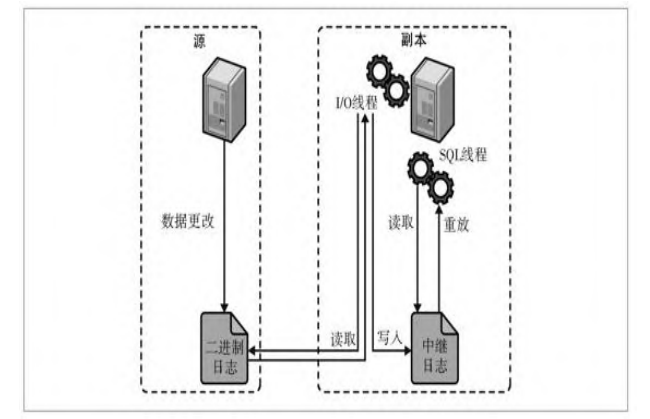

## 1.什么事mysql

mysql是关系型数据库，支持事务，索引，开源的一个数据库

## 2.mysql常用引擎

innodb和myisam

innodb是mysql默认数据库引擎，支持事务，主键索引，支持行级锁

myisam是mysql之前的数据库引擎，不支持事务，只能支持表锁

## 3.聚集索引和非聚集索引

聚集索引：只能有叶子结点存储数据，并且叶子结点顺序是连续的

非聚集索引：叶子结点存储的是主键值，如果可以满足覆盖索引就不需要回表，不满足就需要回表查询

## 4.B+树和B树对比

B+树优点：

 1.只有叶子结点存储数据，内部结点可以存储更多的数据了，减少了树的高度，IO次数也减少了

 2.叶子结点的数据是连续的，范围查询更方便，查询效率稳定，b树的范围查询需要反复查询，

 3.B+树的效率稳定，每次查询都是从根结点到叶子结点，b树可能有的值可能在内部结点也有可能在叶子结点，查询速度不稳定


## 5.索引种类

主键索引：唯一，不可重复，不可为空，并且每个表只能有一个主键索引

组合索引：多个列联合索引，使用的时候要按顺序，要不是可能会不命中

唯一索引：唯一的，可以为null，用来精确查询

全文索引：用来文本查询

普通索引：可以为null，可以重复，没有什么限制，用来加快查询速度

hash索引：提供快速查询，但是不支持排序和范围查询

覆盖索引：select查询的列都有索引，查询条件不能服务查询，好处不需要回表查询了，减少IO速度

前缀查询：对较长文本类型，设置前面几个字符进行查询，加快查询效率


## 6.索引失效的场景

#### 不符合最左原则

- 联合索引中，使用顺序和建立顺序不一致 

  ```
  联合索引 (a,b,c)
  select a,b,c from test where a=1 and c =2 and b=3 索引失效
  ```

- 联合索引中，最前面的列使用了范围查询，导致后续列不能命中索引

- 模糊查询中的，最开头使用了 % 比如 like '%ab%

- OR 连接的条件中，若部分列未建索引，优化器可能放弃索引

  ```
  select name, age from people where name='张三' or age=29
  ```

#### 函数或者表达式操作

- 索引列进行函数操作

```
select * from student where YEAR(create_time) = 2023
```

- 索引列参与计算

```
select * from student where age *2 =10
```

- 索引列使用!=或者<> 操作符

#### 其它情况

- null值，索引不存储null 值, 使用is null 或者 is not null

```
select name from student where name is null
select name from student where name is not null
使用时尽量避免设置null，可以设置为空字符
```

- 类型隐形转换

```
age 类型为int
select name from student where age='29'
```

- 数据量过小或者索引列重复值过多

​    原因：当表数据量极少或索引列重复值过多（如性别字段），优化器可能放弃索引

```
select name from student where sex=‘女’ 
```

- 查询表数据过大

​     原因：回表成本高于全表扫描时，优化器选择全表扫描。

```
select * from student where sex='女'
```

​     解决：减少回表操作，查询列覆盖索引；增加更多过滤条件，减少结果集


## 7.事务

四大特性:原子性：要么成功，要么全部回退 一致性：提交前后的总数是不变的 隔离性：一个事务未提交修改，其它事务是不可见的 持久性：一旦提交就会保存

并发事务的几个问题：

1.脏读：A事务修改了数据，但是还没提交，B事务读取到A修改的数据，后面第一个事务又撤销了修改, B事务读取了无效的数据

2.不可重复读：A事务在执行过程中多次读取了数据，B事务在A事务的中间修改了数据，导致A事务两次读取数据不一致

3.幻读：A事务进行了范围读取，进行多次查询，B事务在A事务执行的过程中增加了数据，前后两次数据不一致

事务的隔离级别：

1. 读未提交：其它事务可以读取，已修改但是没有提交的数据，会带来 脏读，不可重复度，幻读的问题
2. 读已提交：会解决脏读，但是幻读和不可重复读都不可以解决，默认的隔离级别
3. 重复读：事务执行的过程中，数据都不会改变，会解决脏读和不可重复读，幻读还是避免不了
4. 可串行化：最高的隔离级别，会让事务串行执行，但是数据库的性能会下降

## 8.mvcc（多版本控制）

  通过事务版本号和read view进行并发控制的

1.  隐藏字段 每一行记录都包含这些字段

   DB_TRX_ID 事务ID 每次开启事务的时候都会记录的

   DB_ROLL_PTR：回归指针，记录上次数据的地址指针

   DB_ROW_ID：行ID，仅在没有主键或唯一索引时使用

2. undo log

   每次有更新或者删除的时候，都会把数据写入到表中，每个新版本都有一个指针指向旧版本

3. read view 读视图

   read view是事务开启时自动生成的快照视图，根据事务的隔离级别会决定那些数据是可见的，

   可重复读：事务只会开启一个视图，全程不会改变

   读已提交：在select的时候会重新生成开启快照视图

4. MVCC的工作流程

   - insert 会新创建一个数据，事务ID为当前事务ID，回归指针为空，因为没有旧数据
   - update 会把旧数据存入到undo log，并且更新表中的 要修改的数据，指针地址指向旧数据地址，事务ID更新为最新的
   - delete 会把数据从表中删除，存入到undo log 中，方便回归
   - select 会根据当前的read view 规则判断那些数据是可见的

## 9.数据库的锁

1. 从锁粒度分

   | 类型   | 锁定范围   | 作用                                                       |
   | ------ | ---------- | ---------------------------------------------------------- |
   | 全局锁 | 整个数据库 | 数据库做全库备份的时候，这个时候只能读取                   |
   | 表锁   | 整个表     | 锁定整个表，一般用于MYISAM中，锁的开销比较小，但是并发度低 |
   | 行锁   | 对应行     | 锁的开销比较大，innodb默认锁级别，并发性能好               |

2. 从锁的种类分

   共享锁：共享锁一般是读取数据时候加的，其它共享锁也可以访问， 但是阻止其它排它锁进行锁定

   排它锁：只允许自己修改，其它事务不能进行锁定

3. 死锁

   死锁是指多线程或者多进程程中无限期等待对方释放资源的过程，导致了死锁。死锁通常是通过死锁检测和自动回滚其中一个事务来处理的

## 10.数据库基础知识

#### 数据库语言分类

- 数据库定义语言（DDL）：负责表结构的定义 create  drop alter

- 数据库查询语言 （DQL）：负责数据的数据查询 select

- 数据库操作语言（DML）：负责数据的更新 update delete insert

- 数据库控制语言（DCL）: 主要负责权限的控制GRANT COMMIT ROLLBACK REVOKE

  

#### 数据库的约束类型

- 主键约束（primary key）：每个表只能有一个主键，并且要是唯一的，不能为null 
- 唯一约束（unique）：值是唯一的，可以为null 
- 默认约束（default）：插入的时候，没有设置默认值，且数据为空，则设置为null 
- 外键约束（foreign key）：两个表进行关联，从表需要关联主表的 唯一键或者主键
- 非空约束（not null）：值不能为空
- check约束：会限制数据的的值 
- 自动增长（auto_increment）:  设置列的值自动增长，一般与主键一起用

#### 数据库子查询

  概念：数据的子查询可以出现在select from where having 子句中

  假设有两个表 student（学生表）和grades（成绩表）

- 使用案例

  - where

    ```
    select name from student where id in (select student_id from grades) 查询有成绩的学生姓名
    ```

  - from 

    ```
    select s.name, g.avg_score 
    from student as s inner join (
    select student_id,(en+cn+math)/3 as avg_score from grades groub by student_id) as g on s.id = g.student_id 查询学生平均成绩
    ```

  - select 

    ```
    select name,(select (en+cn+math)/3 from grades where grades.student_id=student.id) as avg_score
    from student
    ```

  - having

    ```
    select class, avg(age)
    from student
    groub by class
    having avg(age) > (select avg(age) from student) 找出年龄大于平均年龄的班级
    ```

- 标量子查询 返回单个值 可以使用逻辑判断符号 < > = >= 等等 

  ```
  select name, age
  from student
  where age > (select avg(age) from student)
  ```

- 列子查询，返回的是一列值，不能直接进行逻辑判断需要使用 in any some all 等操作

  ```
  select cn 
  from grades
  where grades.student_id in (
  select id from student where class='12') 查询班级序号12 所有语文成绩
  ```

- 行子查询，返回的是一行N列数据

  ```
  select name , age
  from student
  where (name, age) = (select name , max(age) from student)
  ```

- 表子查询， n行n列的查询 , 一般作为临时表

  ```
  select s.name
  from (select name from age>18) as s
  ```

#### 连接模式

- 左链接 left join  左表的数据都会有，右表没有的数据会赋值null

  ```
  select s.name, g.cn 
  from student as s left join grades as g on s.id = g.student_id
  ```

- 右链接 right join  右表的数据都会有，左表的没有的数据会赋值null

  ```
  select s.name, g.cn 
  from student as s right join grades as g on s.id = g.student_id
  ```

- 内链接 inner join 取两个表的交集

  ```
  select s.name, g.cn 
  from student as s inner join grades as g on s.id = g.student_id
  
  select s.name, g.cn 
  from student as s join grades as g on s.id = g.student_id 这个也是内连接
  
  select s.name, g.cn 
  from student as s inner join grades as g 
  where s.id = g.student_id   隐式内链接
  ```

- 交叉链接 ，会产生笛卡尔积，一般不使用

  ```
  select s.*, g.* 
  from student as s, grades as g
  ```

- 不直接支持全连接（会保留两个表的所有行，没有链接条件则会赋值null） 但是可以通过UNION（会祛除重复的行） 或者union  all（保留重复行，速度更快） 结合LEFT JOIN和RIGHT JOIN来模拟实现

  ```
  （select s.name, g.cn 
  from student as s left join grades as g on s.id = g.student_id）
  union 
  （select s.name, g.cn 
  from student as s right join grades as g on s.id = g.student_id）
  ```

#### in和exists区别

in和exists 都运用于子查询，两个查询原理不同， 子查询结果集都不大的时候没有什么区别

- in

  - 工作原理：in会先查询子查询，然后生成一个临时表（hash），外层表会将结果拿到结果中，进行比较

- exists

  - 工作原理：只判断是否存在行是否存在关联性，不会关注具体的值，`EXISTS`用于检测子查询是否返回任何行。只要子查询能够返回至少一行数据，`EXISTS`就会返回TRUE。它是一种半连接操作，不会等待子查询完全执行完；一旦找到匹配项，就会立即停止继续查找

- 举例

  ```
  select name
  from student
  where id in (select student_id from grades where cn>90)  in的子查询
  
  select s.name
  from sutdet as s
  where exists (select 1 from grades as g where g.student_id=s.id and g.cn>90) exists 查询
  ```

- 结论

  如果子查询结果和外表都很小，差别很小；如果子查询结果小，in 的性能更好；如果子查询结果很大，exists性能更好。

#### char和varchar 的区别

char是定长，最多255，多了会截取，短了会补齐，速度更快，不容易产生磁盘碎片

varchar 是变长的，最多65532，短了不会补齐，会报错，存储效率更好，但是速度慢一些

一般长度变化不大的用char比较好，速度快，变化多的用varchar会更节省空间

#### int(10), char(10), varchar(10)的区别

int(10)只是显示长度有所改变，存储大小不会改变，char（10）和varchar（10） 都会改变存储大小

#### drop delete truncate区别

- drop 删除整个表，不可以回滚，表结构也删除了
- delete 删除数据行，可以回滚
- truncate 删除表数据，表结构还在

#### 临时表

- 临时表的产生：执行SQL过程中产生，只有当前链接可见，当链接关闭的时候会删除临时表
- 临时表在哪几种情况下会产生：
  - from的子查询中
  - distinct查询加上order by
  - order by 和group by 列名不一样的时候
  - union 的过程中

#### SQL语句执行顺序

```
# 查询七年级 英语和语文平均成绩都大于80分且前面10个班级
select DISTINCT s.class , avg(c.cn) as avg_cn, avg(c.en) as avg_en
from student as s left join score as c on s.id = c.student_id
where s.grade = 7
group by s.class
having avg_cn > 80 and avg_en > 80
order by avg_cn, avg_en DESC
limit 10;
```

- from join 确定表
- on 链接是应用
- where 过滤为匹配的行
- group by 进行分组，一般配合聚合查询使用
- having 过滤分组后的结果
- select 选择列和计算表达式
- distinct 去除重复行
- order by 对结果进行排序
- limit 取部分行


## 11.使用性能优化

#### 大表数据如何进行优化

- 适当添加索引：对常用的查询字段建立索引
- 语句优化：
  - 确保查询索引命中
  - select 时候只取需要的字段
  - 用一些子查询代替join 操作，用内链接代替左右链接，避免无效数据
  - 有更新的时候批量操作
- 对数据进行拆分
  - 垂直拆分，按列进行拆分
  - 水平拆分（分库分表），按某种规则将主键进行拆分
- 采用缓存，将经常使用的数据存入到redis里面
- 数据库性能优化：读写分离，或者集群
- 定期维护，删除无效数据

#### 如何分表

  1.垂直分表

- 场景：并发量不大，表的数据也不大，但是数据列特别多，每次查询会产生大量的IO 影响性能
- 拆分：按不通属性进行拆分，比如活跃和非活跃进行拆分

2. 垂直分库

- 场景：并发量比较大，一个表的使用场景特别多，可以根据不同的模块进行分库
- 拆分：按不同的功能模块进行拆分

3. 水平分表

- 场景：并发量不大，但是表的数据量特别大，每次查询特别慢
- 拆分：按照hash算法，或范围对表数据进行拆分

4. 水平分库

- 场景：并发量很大，表的数据量也特别大，每次查询都很慢
- 拆分：按照hash算法，或者范围对表数据进行拆分

#### 慢查询

- 设置慢查询保存参数

  slow_query_log 是否开启慢查询

  slow_query_log_file 慢查询日志保存路径

  long_query_time  慢查询时间

- 如何优化慢查询

  explain 对查询语句进行分析，看是否命中索引

  select 的时候只取相应的字段

  大数据查询的时候，通过limit 限制返回的数量

  分页查询的时候可以通过自增 id 而不是通过offset限制，因为offset 会访问之前的数据，在回取后面的数据，每次都从头开始

#### 主键相关

- 为什么要设置主键？

  引擎需要设置主键，主键是唯一标识方便管理，插入，查询的时候速度回更快，还能保持数据的唯一性

- 使用UUID当主键和自增主键各有什么好处

  - 使用自增主键

    - 好处：自增主键是连续的，符合聚集索引在空间是连续的，查询，增删速度更快

    - 坏处：自增的会有自增锁，很高的并发可能会影响性能

      不像uuid 是全局唯一独立的标识

  - 使用uuid

    - 好处：全局唯一独立的，在拆分数据的时候也是唯一独立的

    - 坏处：uuid是随机生成的，所以不是连续的，操作的时候更费时间

      并且uuid 长度很长，占用空间更大，建立索引需要资源也越大

#### NULL 相关

NULL 是占用空间的，空值是不占用空间的

null 可以设置索引，但是在count时候是统计不到的 并且在NOT in （）集合中包含null 值返回都是null

所以指定尽量设置not null 默认值可以设置 空字符

#### 如何对查询优化

- sql优化：
  - 建立合适的索引，确保索引能改覆盖和命中，减少回表操作
  - select 的时候只拿需要的数据
  - 分页查询的时候，避免offset，看能从主键ID入手
  - 减少在数据库方面的计算，把计算搬到应用层，避免全表扫描
  - 减少比较操作，order by  group by 最好都能命中索引
  - 优化join 的方法，优先链接小表，减少中间的结果集

- 从表的层面：

  对大的数据表进行拆分

- 从系统方面

  增加服务器性能，设置读写分离，分布式系统或添加缓存

#### 如何优化长难查询

将查询语句进行拆分，通过视图或者临时表来保持中间级，并且每个子查询之间通过join链接，对每个子查询的语句进行优化


## 12.部署相关

#### 主从

##### 复制过程

1.源服务器（master）会将对数据更改的数据写入到binglog中

2.副本会将源服务器上的binlog复制到自己的relay log（中继日志）中

3.副本会读取relay log（中继日志）将数据写入到副本中



##### binlog复制格式

mysql 提供了三种不同的二进制日志格式用于复制：基于语句的, 基于行的，混合模式。通过binlog_format设置

- 基于语句

​    通过记录所有在源端的数据变更语句，然后在副本重新执行一遍来实现的。

​    优点：记录数据会变少，节省binlog的空间

   缺点: 不确定性，当有10000条数据的时候，删除1000条数据，但是源数据和副本数据排序方式不同的话，删除的数据可能会不一样

- 基于行的

​    是通过记录每一行的数据变更来实现的，会非常确定的记录

​    优点：没有不确定性，数据会非常可靠

​    缺点：日志会非常大

- 混合模式

​    是对两种模式进行混合，默认情况下是基于语句的，会分析语句，根据情况切换到基于行的

​    优点：在确定性和不确定性中间做了平衡

​    缺点：这也会导致二进制日志中出现不可预测的事件，

- 总结

​    建议采用基于行的，能保证数据的准确性，数据非常的安全；或者根据情况使用基于语句的，不建议采用混合模式

##### 全局事务标识（GTID）

产生的原因：

​    5.6之前，副本必须跟踪连接到源时读取的二进制日志文件和日志位置， 当源数据库崩溃的时候，副本又重新链接的时候怎么确定从那个位置开始，

才能避免复制重复数据，或者避免漏掉重复数据

是什么构成的：

​    server_uuid:事务ID ，是全局唯一的

怎么使用的

   当事务结束的时候，GTID会随着事务一起写入到binlog中，副本线程读取的时候会一起读取写入到副本中，写入完成会记录这个GTID已经完成了

##### 复制的模式

###### 异步复制

- 原理：客户端向主库提交事务后，立马返回响应成功，不用等待从库复制
- 优点：速度快，性能好
- 缺点：主库和从库数据不一致，主库宕机时会发生丢失数据

###### 同步复制

- 原理：主库提交后等所有从库写入到relay log（中继日志）中才能返回
- 优点：保证了数据的一致性和数据不会丢失
- 缺点：速度慢，性能会降低

###### 半同步复制

- 原理：客户端向主库提交事务后，至少有一个从库，把数据同步到relay log中，才能返回
- 优点：保证了数据不会丢失，相对于同步复制性能好
- 缺点：从库延迟过高会退化为异步复制，数据一致性没有保证

##### 优点：

  部署简单，适用于读多写少，对数据库性能和安全要求不高的场景

#### MGR（组副本）

#### 集群


