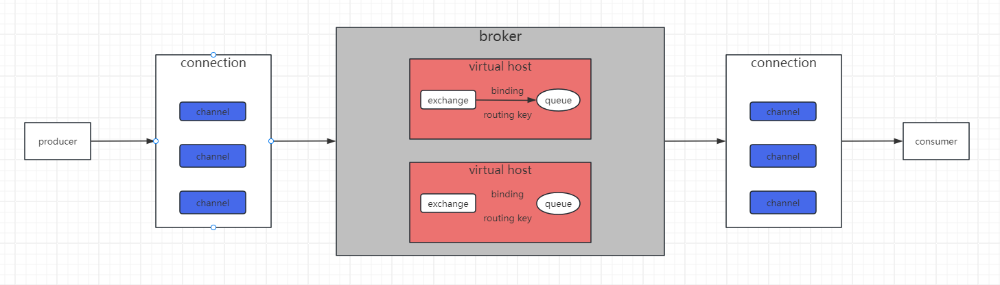
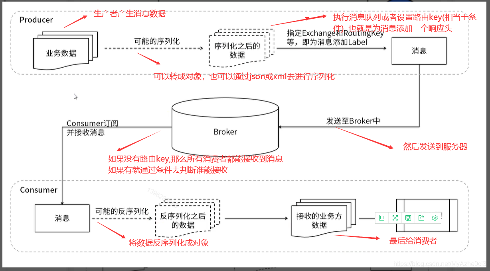

### 一、MQ相关概念

#### 1.1 MQ的基本概念

##### 什么是MQ?

MQ(message queue)是一个先进先出（FIFO）的消息队列，同时具有接受消息，存储消息，发送消息等功能的服务

##### 为什么要用MQ

- 高并发的流量削峰：系统每秒钟只能处理1万个请求，我们可以请求推送到mq，保证每个消息都能被处理，不是超过上限就不处理了
- 应用解耦：应用有多个模块，比如支付，下单，物流等，当物流模块出问题后，会影响用户下单；当基于MQ的时候，物流出问题了，用户可以继续下单，

​    消息放在mq中，用户无感可以正常操作，物流系统恢复后会处理这些消息

- 异步处理：B系统有个耗时操作，A系统需要调用B系统，以前都是A调用B，B返回一个callbackid，B放在队列中慢慢处理，然后A根据callbackid循环访问B系统或者B系统完成后再调用A系统，这样很麻烦，基于MQ后，可以直接把消息推送到MQ中，B系统获取消息处理，完成后再推送到MQ中，A系统监听获取结果
- 分布式事务支持：原来多个服务支付，下单，物流等，都在一个服务，可以利用数据库进行回滚；但是系统并发高了，分了很多个服务，就需要确保数据的一致性了，可以把请求数据放到MQ中，多次请求，或者进行回归操作
- 数据分发：MQ具有发布订阅的关系，不是简单的上下游一对一，支持一对一，一对多或者广播的模式，数据可以分发到多个系统中

##### 常见的MQ

###### **activemq**

- 优点：单机吞吐量万级，时效性 ms 级，可用性高，基于主从架构实现高可用性，消息可靠性较低的概率丢失数据
- 缺点：官方社区现在对 ActiveMQ 5.x **维护越来越少，高吞吐量场景较少使用**。

###### kafka

- 优点：大数据杀手锏，吞吐量百万级，专为高吞吐量设计，支持分布式，支持多个消费组消费
- 使用场景：Kafka 主要特点是基于Pull 的模式来处理消息消费，追求高吞吐量，一开始的目的就是用于日志收集和传输，适合产生**大量数据**的互联网服务的数据收集业务。**大型公司**建议可以选用，如果有**日志采集**功能，肯定是首选 kafka 了。
- 缺点：部署和运维成本高，消息单条限制，为了高并发核心功能集中在消息接收发送，其它高级功能比如延迟消息需要额外开发

###### rabbitMQ

- 优点：由于 erlang 语言的**高并发特性**，性能较好；**吞吐量到万级**，MQ 功能比较完备、健壮、稳定、易用、跨平台、支持多种语言，支持协议也比较广泛
- 缺点：吞吐量不大
- 使用场景：适合时效性要求比较高，复杂路由的系统

###### RocketMQ

- 优点：吞吐量10万左右，可以堆积10亿条消息，同时保证消息不丢失和性能不下降，经过多次阿里双11考验
- 缺点：基于java开发，只支持java和c++语言
- 使用场景：天生为金融互联网领域而生，对于可靠性要求很高的场景，尤其是电商里面的订单扣款，以及业务削峰，在大量交易涌入时，后端可能无法及时处理的情况


#### 1.2 消息队列协议

##### 什么是协议

> 协议：计算机底层操作系统和应用程序通讯时共同遵守的一组约定，只有遵循共同的约定和规范，系统和底层操作系统之间才能相互交流。 和一般的网络应用程序的不同，它主要负责数据的接受和传递，所以性能比较的高。 协议对数据格式和计算机之间交换数据都必须严格遵守规范。

##### 网络协议的三要素

1. 语义

   -  定义：语义定义了协议中消息的含义和目的，即通讯双方需要执行的操作，响应的行为和数据的解释方式，规定了**要做什么**

   -  作用：确保双方对数据的理解一致，避免歧义    
   - 示例：**http协议**：get 请求获取服务器指定的资源，post请求是上传数据

2. 语法

   - 定义：语法定义了数据的格式和结构，包括了字段的顺序，长度和数据类型等，规定了**怎么做**
   - 作用：确保双方可以正确的解析和构建消息
   - 示例：**IP数据报**：版本号、头长度、源IP地址、目的IP地址等字段的严格排列

3. 时序

   - 定义：时序定义了事件的顺序，时间间隔和流程控制规则，规定了**什么时候做**
   - 作用：确保双方按照预定的顺序操作，避免冲突和性能问题
   - 示例：**TCP协议**：SYN-->SYN-ACK-->ACK，确保了连接可靠建立；**HTTP协议**：一个请求只能对应一个响应 


##### 常用的消息中间件协议

1.`AMQP`协议（Advanced Message Queuing Protocol—高级消息队列协议）

> 它由摩根大通集团联合其他公司共同设计。是一个提供统一消息服务的应用层标准高级消息队列协议，是应用层协议的一个开放标准，为面向消息的中间件设计。基于此协议的客户端与消息中间件可传递消息，并不受客户端/中间件不同产品，不同的开发语言等条件的限制。

**特性**：分布式事务支、消息的持久化支持、高性能和高可靠的消息处理优势

AMQP典型的实现者是`RabbitMQ`、`ACTIVEMQ`等，其中`RabbitMQ`由`Erlang`开发

img

2.`MQTT`协议（Message Queueing Telemetry Transport—消息队列遥测传输协议）

> 它是一种基于发布/订阅（publish/subscribe）模式的"轻量级"通讯协议，该协议构建于TCP/IP协议上，由IBM在1999年发布。

**特点**：轻量、结构简单、传输快、不支持事务、没有持久化设计

**应用场景**：适用于计算能力有限、低带宽、网络不稳定的场景

**支持者**：`RabbitMQ`、`ACTIVEMQ`（默认情况下关闭，需要打开）

img

3.`OpenMessage`协议

> 是近几年由阿里、雅虎和滴滴出行、 Stremalio等公司共同参与创立的分布式消息中间件、流处理等领域的应用开发标准。

**特点**：结构简单、解析速度快、支持事务和持久化设计

4.`Kafka`协议

> 基于TCP/IP的二进制协议。消息内部是通过长度来分割，由些基本数据类型组成。

**特点**：结构简单、解析速度快、无事务支持、有持久化设计

#### 1.3 消息持久化

> 持久化就是将消息存入磁盘中，而不是存在内存中随服务重启而消失，是消息能够永久保存

**常见的消息队列持久化方式**

|          | ActiveMQ | RabbitMQ | Kafka | RocketMQ |
| :------- | :------- | :------- | :---- | :------- |
| 文件存储 | 支持     | 支持     | 支持  | 支持     |
| 数据库   | 支持     | /        | /     | /        |

#### 1.4 消费分发策略

##### 1.4.1 MQ基本组件

> producer（生产者） -->  broker（消息中间件）--> consumer（消费者）

介绍：

1. producer: 生成者往broker中上传消息，负责消息的产生
2. broker：消息中间件，负责消息存储，确认，分发等
3. consumer：消费者，从消息中间件获取消息，进行对应的处理

##### 1.4.2  常见MQ支持策略对比

|          | ActiveMQ | RabbitMQ | Kafka | RocketMQ |
| :------- | :------- | :------- | :---- | :------- |
| 发布订阅 | 支持     | 支持     | 支持  | 支持     |
| 轮询分发 | 支持     | 支持     | 支持  | /        |
| 公平分发 | /        | 支持     | 支持  | /        |
| 重发     | 支持     | 支持     | /     | 支持     |
| 消息拉取 | /        | 支持     | 支持  | 支持     |


### 二、rabbitMQ入门

#### 2.1 rabbitMQ概述

>rabbitMQ是一个消息中间件，负责接收，存储，转发消息数据

#### 2.2 架构组成

**架构图**



详细介绍：

- producer: 生产者，负责消息的产生
- connection：链接，消费者/生产者与broker TCP长链接
- channel：网络信道，多个channel共用一个connection减少网络开销，并且每个channel都是独立的会话单元，可以设置不同的资源和配置
- message：消息，由两部分properties和body组成，properties是对消息进行设置，比如消息的优先级，延迟等高级特性，body则是消息的具体内容
- broker：Broker 是 RabbitMQ 的核心服务实例，负责消息的存储、路由和转发
- virtual host：虚拟节点，逻辑隔离的命名空间，用于多租户环境；每个vhost包含多个交换机和队列，同一个vhost下面的交换机名称不能重复，不同vhost下面的可以重复
- exchange：交换机，负责接收消息，并且通过路由分发到不同queue中
- queue：队列，存储消息，等待消费者拉取消息
- bingding：负责exchange和queue的链接，通过routing key实现，binding信息会被保存到exchange查询表中，用于message的分发
- routing key：路由规则，交换机可以用它来确定如何路由一个特定消息
- consumer：消费者，从队列中获取消息，然后处理消息

**运行流程**

#### 


### 三、六种工作模式

#### 1.理论

> rabbitmq提供了六种工作模式，分别为：简单模式（simple worker queues），工作模式（worker queues），发布订阅模式（Publish/Subscribe），路由模式（routing），主题模式（topics），rpc远程调用模式（远程调用，不太算消息队里）

#### 2. 简单模式

- **定义**：一个生产者将消息发送到一个队列中，一个消费真进行消费，无需交换机

- **特点**：

  >  每个队列一个消费者一个生产者
  >
  > 无需交换机

- **使用场景**：任务分发 ，负载均衡

#### 3.工作模式

- **定义**：一个生产者，一个队列通过轮询分发多个消费者，无需交换机，或者交能者多劳模式，处理的快，处理的消息就越多
- **特点**：

> 消费者需手动确认消息（ACK），未确认的消息不会被分配给其他消费者
>
> 避免慢消费者拖慢整体进度

- **使用场景**：高负载任务处理（如订单处理、短信服务）

#### 4.发布订阅模式

- **定义**：生产者会将消息发送到fanout类型的交换机，交换机会将消息发送到所有绑定的队列里面，与队列绑定的消费者都可以收到消息
- **特点**：

> 忽略routing key（路由键）
>
> 消息被所有订阅者接收，适合广播场景
>
> 如果没有队列与交换机绑定的话，消息会丢失
>
> 动态添加消费者时仍能接收到消息

- **使用场景**：日志收集、实时通知（如监控系统）

#### 5.路由模式

- **定义**：使用Direct类型的交换机，消息根据精确匹配的 routing key分发到队列中
- **特点**：

> 队列绑定到特定的 Routing Key，消息仅发送到匹配的队列
>
> 支持定向消息传递

- **使用场景**：错误通知、定向任务分发

#### 6.主题模式

- **定义**: 使用topic类型的交换机，通过通配符匹配routing key分发消息
- **特点**:

>支持复杂路由规则（`*` 匹配一个词，`#` 匹配多个词）
>
>路由键为多词组合（如 `stock.usd.nyse`）
>
>适用于事件过滤（如股票价格监控、日志分级）

- **使用场景**: 动态路由、多级分类（如新闻订阅）

#### 7.RPC 模式（Remote Procedure Call）

- **定义**：客户端发送请求并等待服务端响应，通过临时队列和消息关联, 使用 **Correlation ID** 和 **Reply To** 字段匹配请求与响应
- **特点**：

>适用于同步调用（如远程服务调用
>
>需要客户端和服务端配合实现

- **使用场景**：分布式系统中的远程方法调用（如订单查询、支付验证）


### 四、四种交换机

#### 1.直流交换机（direct）

- **路由规则**：

1. 消息的 **路由键（Routing Key）** 必须与队列绑定的 **绑定键（Binding Key）** **完全匹配**，消息才会被路由到对应的队列
2. 区分大小写
3. 可以多个队列使用相同的binding key, 多个队列都可以收到消息

- **使用场景**：适用于需要精确匹配的场景，例如任务分类（如订单处理、日志级别区分

#### 2.扇形交换机（fanout）

- **路由规则**：

1. 忽略routing key，与之绑定的所有队列都可以收到消息

- **使用场景**：适用于需要广播消息的场景，例如实时通知、配置更新

#### 3.主题交换机（topic）

- **路由规则**：

1. 根据消息的路由键和队列的binding key 进行匹配决定
2. 支持通配符 
   -  *匹配一个单词，比如（user.`*`，可以匹配user.login，user.loginout，但是不可以匹配 user.login.info）
   - #匹配多个单词，比如（user.#，可以匹配user.login，user.loginout和user.login.info）
3. 当绑定键不包含通配符时，行为类似于直连交换机

- **使用场景**：适用于需要灵活路由的场景，例如多层次分类（如新闻订阅、设备监控）

#### 4.头交换机（headers）

- **路由规则**：

1. 根据消息的 **头部信息（Headers）** 进行匹配，而非路由键

2. 支持两种匹配模式：

   - **全部匹配**：x-match=all 消息头的所有键值对必须与绑定规则匹配

   >队列绑定条件：`{"type": "urgent", "priority": "high", "x-match": "all"}`
   >
   >消息头：`{"type": "urgent", "priority": "high", "source": "systemA"}` → **匹配**
   >
   >消息头：`{"type": "urgent", "source": "systemA"}` → **不匹配**（缺少 `priority` 键）
   >
   >消息头：`{"type": "urgent", "priority": "medium"}` → **不匹配**（`priority` 值不匹配）

   - **任意匹配**：x-match = any 消息头中任意一个键值对匹配即可

   >队列绑定条件：`{"type": "urgent", "priority": "high", "x-match": "any"}`
   >
   >消息头：`{"type": "urgent", "source": "systemA"}` → **匹配**（`type` 匹配）
   >
   >消息头：`{"priority": "high", "source": "systemB"}` → **匹配**（`priority` 匹配）
   >
   >消息头：`{"source": "systemC"}` → **不匹配**（无键值对匹配）

3. 键名区分大小写（如 `Type` 和 `type` 视为不同键）

4. 值必须严格匹配绑定的类型和格式（如字符串 `"1"` 与数字 `1` 不匹配）

- **使用场景**：适用于基于消息元数据（如内容类型、优先级）的路由。


### 五 、消息的可靠投递

#### 1.开启持久化

消息持久化，exchange持久化，queue持久化

#### 2.**生产者**

>生产者通过 **发布确认（Publisher Confirm）** 机制，确保消息被 RabbitMQ 成功接收和存储。以下是实现步骤：

##### 2.1 开启发布确认

```python
import pika

# 创建连接和通道
connection = pika.BlockingConnection(pika.ConnectionParameters('localhost'))
channel = connection.channel()

# 声明队列（如果队列已存在可跳过）
channel.queue_declare(queue='task_queue', durable=True)

# 开启发布确认模式
channel.confirm_delivery()
```

##### 2.2 同步等待确认

```
def publish_message():
    try:
        # 发送消息
        channel.basic_publish(
            exchange='',
            routing_key='task_queue',
            body='Hello, RabbitMQ!',
            properties=pika.BasicProperties(delivery_mode=2)  # 消息持久化
        )
        # 等待确认
        if channel.wait_for_confirms():
            print("消息已成功发送到 RabbitMQ")
        else:
            print("消息发送失败，需重试")
    except pika.exceptions.UnroutableError:
        print("消息无法路由，需处理异常")
```

##### 2.3 异步等待确认

```
def async_publish_message():
    # 定义确认回调
    def on_confirm(method_frame):
        if method_frame.method.NAME == "Basic.Ack":
            print("消息确认成功")
        elif method_frame.method.NAME == "Basic.Nack":
            print("消息确认失败")

    # 添加回调监听
    channel.add_on_return_callback(on_confirm)

    # 发送消息
    channel.basic_publish(
        exchange='',
        routing_key='task_queue',
        body='Async Message',
        properties=pika.BasicProperties(delivery_mode=2),
        mandatory=True  # 强制要求 RabbitMQ 返回确认
    )

    # 关闭连接（可选）
    connection.close()
```

#### 3.消费者

>消费者通过 **手动确认（Manual Ack）** 机制，确保消息在处理完成后才被 RabbitMQ 删除

##### 3.1 手动确认

```python
def callback(ch, method, properties, body):
    try:
        # 处理消息（模拟业务逻辑）
        print(f"收到消息: {body.decode()}")
        # 模拟异常（注释掉以测试成功处理）
        # raise Exception("处理失败")

        # 手动确认消息
        ch.basic_ack(delivery_tag=method.delivery_tag)
        print("消息已确认")
    except Exception as e:
        print(f"消息处理失败: {e}")
        # 拒绝消息并重新入队
        ch.basic_nack(delivery_tag=method.delivery_tag, requeue=True)
        print("消息已拒绝并重新入队")

# 启动消费者
channel.basic_consume(
    queue='task_queue',
    on_message_callback=callback,
    auto_ack=False  # 关闭自动确认
)

print('等待消息... 按 Ctrl+C 退出')
channel.start_consuming()
```

##### 3.2 关键点说明

- **`auto_ack=False`**：禁用自动确认，确保消息在处理完成前不会被删除
- **`ch.basic_ack()`**：手动确认消息，RabbitMQ 会删除该消息
- **`ch.basic_nack(requeue=True)`**：拒绝消息并重新入队，RabbitMQ 会重新投递消息给其他消费者


#### 4.消息幂等性

##### 4.1 概述

>**幂等性**是指对同一操作的多次请求与一次请求的结果相同。在消息队列系统中，幂等性是解决消息重复消费问题的核心机制。由于消息可能因网络故障、消费者崩溃或ACK确认失败等原因被重复投递，消费者必须确保即使收到重复消息，业务逻辑也能正确执行

##### 4.2 消息重复投递的场景

- 生产者发送消息broker接收到消息因为一些原因没有收到Confirm，导致重发消息
- 消费者收到消息后，但是因为一些原因没有确认ACK，导致消息被重新投递
- broker故障，导致消息重复投递

##### 4.3 实现方案

###### 4.3.1 设置唯一ID

>推送消息的时候给消息添加唯一ID，将数据ID进行记录，确保ID没有被消费过

###### 4.3.2 给数据设置版本号

> 更新数据的时候确保版本号是最新的，防止重复修改

###### 4.3.3 分布式锁

> 在分布式环境下结合分布式锁（如Redis RedLock）

#### 5.配置死信队列（DLQ）

##### 5.1 概述

**死信队列**（Dead Letter Queue）是RabbitMQ中处理无法被正常消费的消息的机制。当消息成为“死信”时，会被自动路由到死信队列，供后续处理（如人工干预、日志分析、重试等）。

##### 5.2 消息成为死信的条件

- 消费者显式拒绝且不重新入队

  > 通过调用basic_reject或者basic_ack，并且设置requeue=False
  >
  > ```python
  > import pika
  > 
  > def callback(ch, method, properties, body):
  >     print(f"Received message: {body.decode()}")
  >     try:
  >         # 模拟消息处理失败
  >         if body.decode() == "error_message":
  >             raise ValueError("Invalid message content")
  >         # 如果消息处理成功，手动确认
  >         ch.basic_ack(delivery_tag=method.delivery_tag)
  >     except Exception as e:
  >         print(f"Error processing message: {e}")
  >         # 拒绝消息，且不重新入队（requeue=False）
  >         ch.basic_reject(delivery_tag=method.delivery_tag, requeue=False)
  > 
  > # 设置消费者
  > channel.basic_consume(queue='normal_queue', on_message_callback=callback)
  > 
  > print("Waiting for messages...")
  > channel.start_consuming()
  > ```

- 消息超时未消费

  > 队列或消息设置了TTL（Time To Live），消息在存活时间到期后未被消费

- 队列达到最大容量

  >队列通过 `x-max-length` 设置最大长度，新消息导致旧消息被挤出队列

##### 5.3 死信队列的处理步骤

- 添加死信队列交换机

- 添加绑定死信的队列

- 添加死信队列的消息者，对队列进行处理

- 示例

  ```
  # 声明普通队列并绑定死信交换机
  channel.queue_declare(
      queue='normal_queue',
      arguments={
          'x-dead-letter-exchange': 'dlx_exchange',  # 死信交换机
          'x-message-ttl': 60000  # 队列级别TTL（单位：毫秒）
      }
  )
  
  # 声明死信交换机和队列
  channel.exchange_declare(exchange='dlx_exchange', exchange_type='direct')
  channel.queue_declare(queue='dead_letter_queue')
  channel.queue_bind(queue='dead_letter_queue', exchange='dlx_exchange', routing_key='dlq')
  ```

##### 5.4 死信队列的应用场景

- **消息重试**：死信队列的消费者可对消息进行重试（如3次），若仍失败则转人工处理
- **日志分析**：收集死信消息用于分析失败原因（如参数错误、服务不可用）
- **延迟任务**：结合TTL和死信队列实现延迟队列（如订单超时未支付自动取消）
- **业务补偿**：死信消息触发补偿逻辑（如退款、通知用户）

### 六、消息格式

> 消息分为消息头和body两部分

#### 6.1 消息头

```
import pika
import time

# 生产者
connection = pika.BlockingConnection(pika.ConnectionParameters('localhost'))
channel = connection.channel()

# 声明队列
channel.queue_declare(queue='headers_queue', durable=True)

# 设置消息头
properties = pika.BasicProperties(
    content_type='application/json', # 消息内容的类型
    content_encoding='utf-8', # 消息内容格式
    delivery_mode=2,  # 持久化消息
    priority=5,       # 消息优先级
    timestamp=int(time.time()),  # 时间戳
    message_id='msg-12345',      # 消息 ID
    correlation_id='req-7890',   # 关联 ID
    reply_to='response_queue',   # 回调队列
    expiration='60000',          # 消息过期时间（毫秒）
    user_id='admin',             # 用户 ID
    app_id='my_app'              # 应用 ID
)

# 发送消息
message = "Hello, RabbitMQ Headers!"
channel.basic_publish(
    exchange='',
    routing_key='headers_queue',
    body=message,
    properties=properties
)

print(" [x] Sent message with headers")
connection.close()
```

#### 6.2 消息正文

消息正文是二进制数据（`bytes`），实际内容由生产者和消费者约定。常见的格式包括：

- **纯文本**（`text/plain`）
- **JSON**（`application/json`）
- **XML**（`application/xml`）
- **二进制数据**（如图片、文件）
- **自定义序列化格式**（如 Protobuf、MsgPack）

```
import pika
import json

# 生产者
connection = pika.BlockingConnection(pika.ConnectionParameters('localhost'))
channel = connection.channel()

message = {
    "id": 1,
    "name": "张三",
    "email": "zhangsan@example.com"
}

channel.basic_publish(
    exchange='',
    routing_key='task_queue',
    body=json.dumps(message),
    properties=pika.BasicProperties(
        content_type='application/json',
        delivery_mode=2  # 持久化消息
    )
)

print(" [x] Sent JSON message:", message)
connection.close()
```


### 七、TTL过期时间

##### 7.1 TTL 的定义

 TTL 表示消息或队列的最大存活时间（单位：毫秒）。

- **消息 TTL**：单条消息的存活时间。
- **队列 TTL**：队列中所有消息的默认存活时间。

##### 7.2 TTL 的作用

- 避免消息在队列中堆积，节省资源。
- 实现业务逻辑中的“超时处理”（如订单超时取消、缓存过期等）。
- 与死信队列（DLQ）结合，实现延迟队列功能。

##### 7.3 注意

- 消息的 TTL 仅在队列中生效。
- 如果两者都进行了设置，以时间短的为准
- 如果消息未被消费且超过 TTL，会被标记为“死信”（Dead Message），并根据配置删除或转移到死信队列

##### 7.4 实际应用场景

1. **订单超时取消**：
   - 用户下单后未支付，30 分钟后自动取消订单。
   - **实现**：通过 TTL 设置消息的存活时间为 30 分钟，过期后触发死信队列处理取消逻辑。
2. **缓存失效**：
   - 缓存数据在一定时间后自动过期，通过 TTL 控制缓存生命周期。
3. **任务超时处理**：
   - 网络请求超时未响应时，通过 TTL 触发重试或告警。
4. **定时通知**：
   - 会议开始前 30 分钟发送提醒通知（结合 TTL + DLQ 实现延迟队列）。

### 八、优先级设置

#### 8.1 概述

> RabbitMQ 的优先级队列允许为消息分配不同的优先级，确保高优先级的消息优先被消费

#### 8.2 关键点

- 声明队列的时候使用x-max-priority 设置

  > 范围最大为0-255,  使用时数字越大优先级越高，推荐10 设置过大会影响性能, 
  >
  > 一旦设置就无法更改

- 在发布消息时，通过 `priority` 字段设置优先级

- 消费者的处理方式

  - 无需特殊处理，自动接收优先级高的消息

- 队列的排序

  - 队列内部按优先级排序，优先级高的消息在前面
  - 同一优先级的消息，还是FIFO（先进先出）

#### 8.3 配置步骤

- 声明队列设置优先级范围

  ```python
  import pika
  
  # 创建连接和通道
  connection = pika.BlockingConnection(pika.ConnectionParameters('localhost'))
  channel = connection.channel()
  
  # 声明一个支持优先级的队列，最大优先级设为10
  queue_name = 'priority_queue'
  args = {
      'x-max-priority': 10  # 设置最大优先级为10
  }
  channel.queue_declare(queue=queue_name, arguments=args)
  ```

- 发送消息的时候配置优先级

  ```python
  import pika
  
  # 创建连接和通道
  connection = pika.BlockingConnection(pika.ConnectionParameters('localhost'))
  channel = connection.channel()
  
  # 声明一个支持优先级的队列，最大优先级设为10
  queue_name = 'priority_queue'
  args = {
      'x-max-priority': 10  # 设置最大优先级为10
  }
  channel.queue_declare(queue=queue_name, arguments=args)
  
  # 发送不同优先级的消息
  def send_message(priority, message_body):
      properties = pika.BasicProperties(priority=priority)
      channel.basic_publish(
          exchange='',
          routing_key=queue_name,
          body=message_body,
          properties=properties
      )
      print(f"Sent: {message_body} (Priority: {priority})")
  
  # 示例：发送两条消息，一条高优先级，一条低优先级
  send_message(10, "Urgent Task")
  send_message(1, "Normal Task")
  
  connection.close()
  ```

  

#### 8.4 注意事项

- 性能开销：
  - 维护优先级排序会增加内存和 CPU 开销，尤其在消息量大的场景。
  - 优先级范围越大（如 `0-255`），排序复杂度越高。
- 低优先级消息风险：
  - 若高优先级消息持续涌入，低优先级消息可能长期无法被处理。
  - 解决方案：
    - **时间衰减机制（Aging）**：为低优先级消息设置等待时间，超时后提升优先级。
    - **动态调整**：根据业务需求动态修改消息优先级。
    - **容量限制**：限制队列中高优先级消息的数量，避免低优先级消息被淹没。

#### 8.5 实际场景应用

> 需要优先处理某些关键任务（如紧急订单、系统告警、VIP用户请求等）

### 九、延迟队列

#### 9.1 概述

> 延迟队列，即消息进入队列后不会立即被消费，只有到达指定时间后，才会被消费。在RabbitMQ中并未提供延迟队列功能，但是可以使用：TTL+死信队列 组合实现延迟队列的效果 ，通过安装插件rabbitmq_delayed_message_exchange 两种方式实现

#### 9.2 插件实现

- **安装插件**

  ```
  # 下载插件
  wget https://github.com/rabbitmq/rabbitmq-delayed-message-exchange/releases/latest/download/rabbitmq_delayed_message_exchange-3.19.0.ez
  
  # 启用插件
  rabbitmq-plugins enable rabbitmq_delayed_message_exchange
  ```

- 生产者代码

  ```python
  import pika
  import json
  
  connection = pika.BlockingConnection(pika.ConnectionParameters('localhost'))
  channel = connection.channel()
  
  # 声明延迟交换器（类型为 x-delayed-message）
  channel.exchange_declare(
      exchange='delayed_exchange',
      exchange_type='x-delayed-message',
      arguments={'x-delayed-type': 'direct'}
  )
  
  message = {
      'content': 'Hello, this is a delayed message!',
      'timestamp': '2023-10-01T12:00:00Z'
  }
  
  # 发送消息并设置延迟时间（单位：毫秒）
  channel.basic_publish(
      exchange='delayed_exchange',
      routing_key='test',
      body=json.dumps(message),
      properties=pika.BasicProperties(
          headers={'x-delay': 5000}  # 延迟5秒
      )
  )
  
  print(" [x] Sent delayed message")
  connection.close()
  ```

- 消费者代码

  ```python
  import pika
  import json
  
  def callback(ch, method, properties, body):
      print(" [x] Received:", json.loads(body.decode()))
  
  connection = pika.BlockingConnection(pika.ConnectionParameters('localhost'))
  channel = connection.channel()
  
  # 声明队列并绑定到延迟交换器
  channel.queue_declare(queue='delayed_queue')
  channel.queue_bind(
      exchange='delayed_exchange',
      queue='delayed_queue',
      routing_key='test'
  )
  
  channel.basic_consume(
      queue='delayed_queue',
      on_message_callback=callback,
      auto_ack=True
  )
  
  print(' [*] Waiting for messages. To exit press CTRL+C')
  channel.start_consuming()
  ```

#### 9.3 使用TTL+死信队列实现

- **生产者声明配置**

  ```python
  import pika
  import json
  import time
  
  connection = pika.BlockingConnection(pika.ConnectionParameters('localhost'))
  channel = connection.channel()
  
  # 声明死信交换器和队列
  channel.exchange_declare(exchange='dlx_exchange', exchange_type='direct')
  channel.queue_declare(queue='dlx_queue')
  
  # 声明普通交换器和队列
  channel.exchange_declare(exchange='normal_exchange', exchange_type='direct')
  channel.queue_declare(queue='normal_queue', arguments={
      'x-message-ttl': 5000,  # 5秒TTL
      'x-dead-letter-exchange': 'dlx_exchange'  # 死信交换器
  })
  
  message = {
      'content': 'Hello, this is a TTL-based delayed message!',
      'timestamp': time.strftime('%Y-%m-%d %H:%M:%S')
  }
  
  channel.basic_publish(
      exchange='normal_exchange',
      routing_key='normal_key',
      body=json.dumps(message)
  )
  
  print(" [x] Sent TTL-based delayed message")
  connection.close()
  ```

- **消费者从死信队列中获取消息**

  ```python
  import pika
  import json
  
  def callback(ch, method, properties, body):
      print(" [x] Received (DLQ):", json.loads(body.decode()))
  
  connection = pika.BlockingConnection(pika.ConnectionParameters('localhost'))
  channel = connection.channel()
  
  # 绑定死信交换器和队列
  channel.queue_bind(
      exchange='dlx_exchange',
      queue='dlx_queue',
      routing_key='dlx_key'
  )
  
  channel.basic_consume(
      queue='dlx_queue',
      on_message_callback=callback,
      auto_ack=True
  )
  
  print(' [*] Waiting for DLQ messages. To exit press CTRL+C')
  channel.start_consuming()
  ```

#### 9.4 使用场景

- 订单超时关闭， 下单超时30分钟未支付
- 预约与定时事件
- 秒杀，或者倒计时活动
