## 一、redis简介

### 1.1 定义

> redis是一个基于键值对的非关系数据库（NOSQL）

### 1.2 优点

- 速度快
- 支持持久化
- 支持主从复制
- 支持分布式

### 1.3 redis为啥那么快

- 读写方便采用单线程，避免资源竞争，减少开销

- 数据存放在内存中，读取效率快

- 支持网络多IO复用，减少阻塞，充分利用CPU，提供并发

  

  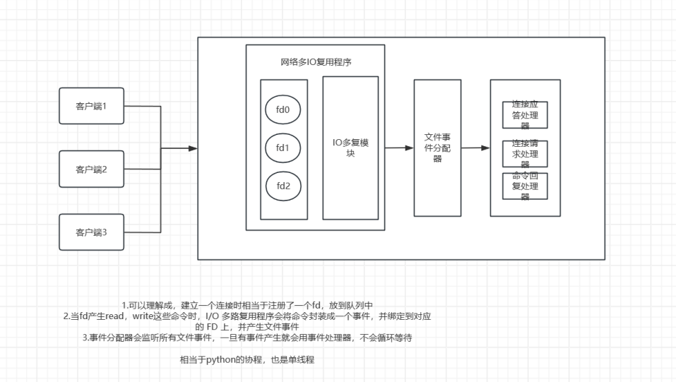

### 1.4 redis可以用来干嘛

- 缓存热点数据
- 分布式会话管理
- 分布式锁，使用 `SETNX`（SET if Not eXists）尝试加锁，通过 `EXPIRE` 防止死锁
- 消息队列，生产者用 `LPUSH` 推送任务，消费者用 `BRPOP` 阻塞式获取任务
- 计数器，使用 `INCR`、`DECR` 实现原子递增/递减
- 限流技术，每次访问 setnx 加锁 修改值，每间隔一段时间加锁添加值
- 地理位置服务，通过GEO数据实现
- 交流圈，通过集合实现，进行相关

## 二、数据结构

### 2.1 基本命令

- keys *: 获取所有的可以，时间 o(n) ，尽量不要随意使用
- dbsize：返回键总数，时间0(1)
- expire key seconds：设置过期时间 默认s
- ttl key：查看过期时间，>0 未过期，-1 已过期
- del key [key1 ...]：删除数据 ，key 键名 ,时间复杂度o(n)，n是key的数量
- type key： 查看键的类型
- object encoding key：查看内部编码

### 2.2 **字符串**

#### 2.2.1 定义

> vuale支持字符串，json，二级值，最大值不超过512M

#### 2.2.2 内部编码

> redis 会根据当前字节大小自己选择编码

- int：8个字节的长整形
- embstr：小于等于39字节的字符串
- raw：大于39字节的字符串

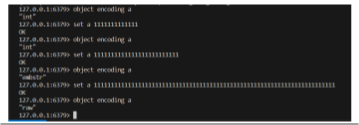


#### 2.2.3 常用命令

- **set key value ex|px nx|xx**

  - key 键名
  - value 值
  - ex 过期时间s
  - px 过期时间hs
  - nx 键不存在的时候才可以添加
  - xx 只有键存在的时候才可以设置

  > o(1)

- **setnx key value** 

  > 键不存在的时候添加值
  >
  > o(1)

- **mset key1 value2 key2 value2**

  > 批量添加键，能使用mset的情况尽量使用mset， 减少交换
  >
  > o(n) n是key的数量

- **get key**

  > 获取单个键的值
  >
  > o(1)

- **mget key1 key2**

  > 批量获取值
  >
  > o(n) n是key的数量

- **incr key **

  > 自增+1
  >
  > o(1)

- **decr key**

  > 自减1
  >
  > o(1)

- **incrby key num**

  > 自增指定的整数值
  >
  > o(1)

- **decrby key num**

  > 减少指定整数值
  >
  > o(1)

- **incrbyfloat key num**

  > 自增浮点数，但是有可能会精度丢失
  >
  > o(1)

#### 2.2.4 不常用命令

- **append key value** 

  > 向字符串末尾最近值

- **strlen key**

  > 返回字符串的长度

- **getset key value**

  > 设置新值并且返回原值

- **setrang key offset value**

  > 设置字符串指定位置的值

- **getrang key start end**

  > 获取某个范围的值

#### 2.2.5 使用场景

- **缓存**

  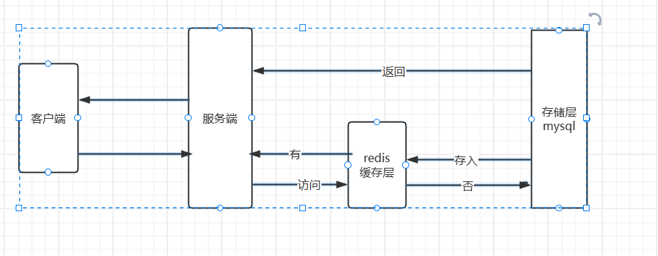

- **计数器，点赞**

  > 通过 incr 和 decr 

- **分布式锁**

  > 1.通过set key vavlue nx  ex进行加锁, 并且确保不会死锁，过期释放锁
  >
  > 2.操作完成后，再通过del key 删除锁
  >
  > 经典常见，秒杀，限流

- **共享session**

  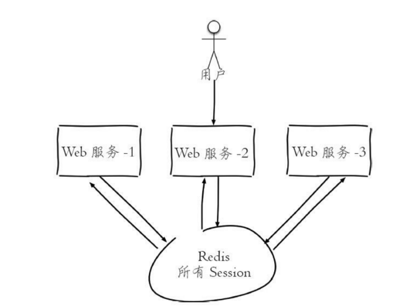

  

  

### 2.3 hash

#### 2.3.1 定义

> value 必须是字典对象

#### 2.3.2 内部编码

- ziplist（压缩列表）：

  > 当哈希类型元素个数小于hash-max-ziplistentries配置（默认512个）、同时所有值都小于hash-max-ziplist-value配置（默认64字节）时，Redis会使用ziplist作为哈希的内部实现，ziplist使用更加紧凑的结构实现多个元素的连续存储，所以在节省内存方面比hashtable更加优秀。

- hashtable（哈希表）：

  > 当哈希类型无法满足ziplist的条件时，Redis会使用hashtable作为哈希的内部实现，因为此时ziplist的读写效率会下降，而hashtable的读写时间复杂度为O（1）

#### 2.3.3 常用命令

- **hset key field value [field1 value1 ...]**

  > 添加hash 对象， key 键名， field 属性，value对应属性值 
  >
  > 时间复杂度 o(1)

- **hget key field**

  > 获取hash对象，某个属性值
  >
  > o(1)

- **hmget key field [filed1...]**

  > 批量获取 key
  >
  > o(n) n是key的数量

- **hdel key field [field1...]**

  > 批量删除 hash 对象的 属性
  >
  > o(n) n是field的数量

- **hlen key**

  > 获取hash 对象属性的数量
  >
  > o(1)

- **hexits key field**

  > 判断hash key 是否存在某个属性
  >
  > o(1)

- **hkeys key** 

  > 获取对象的所有field
  >
  > o(n) n是field的数量

- **hvals key**

  > 获取所有field对应的值
  >
  > o(n) n是field的数量

- **hgetall key** 

  > 获取所有的field和其对应的值
  >
  > o(n) n是field的数量

- **hincrby key field num**

  > 对hash对象某个field 设置自增整数
  >
  > o(1)

- **hincrbyfloat key field num**

  > 对hash对象某个field 设置自增整数
  >
  > o(1)

- **hstrlen key field**

  > 获取hash对象field 对应value长度
  >
  > o(1)

#### 2.3.4 使用场景

- **存储对象，比如用户信息**

  - **存储对象和字符串对比图**

    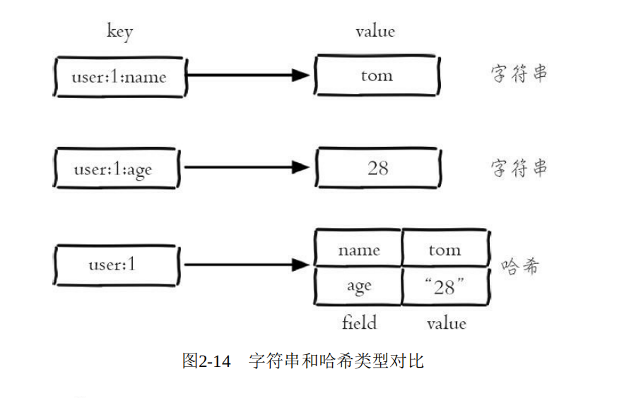

  - 使用`user:key:field` 字符串方式存储对象信息

    - 优点：每个属性都可以进行单独操作
    - 缺点：设计复杂，数据比较分散，不易操作

  - 使用`user:key` 字符串存储序列化后的对象信息

    - 优点：无需维护字段结构，适合快速实现
    - 缺点：每次读取和更改都要序列化操作，消耗资源

  - 使用`user:key` hash对象存储对象信息

    - 优点：结构简单明了，redis支持一些相应操作
    - 缺点：如果对象字段极少（如 1~2 个字段），Hash 的结构开销（如哈希表头）可能超过实际数据大小，跨语言需要手动处理类型

  

  

  

  
  

### 2.4 **list（列表）**

#### 2.4.1 定义

> list是一个有序列表，可以存储2*32 -1个对象，支持从两端删除和插入。可以充当栈和队列

#### 2.4.2 内部编码

- ziplist（压缩列表）：

  > 当列表的元素个数小于list-max-ziplist-entries配置（默认512个），同时列表中每个元素的值都小于list-max-ziplistvalue配置时（默认64字节），Redis会选用ziplist来作为列表的内部实现来减少内存的使用。

- linkedlist（链表）：

  > 当列表类型无法满足ziplist的条件时，Redis会使用linkedlist作为列表的内部实现

#### 2.4.3 常用命令

- **lpush key value [value1 ...]**

  >从列表的左边添加值
  >
  >o(1)

- **rpush key value [value1 ...]**

  >从列表的右边添加值
  >
  >o(1)

- **linsert key before|after pivot value**

  >在列表中指定元素的前或后插入新元素，存在多个pivot，则使用第一个匹配到的，pivot不存在时返回-1，key不存在的话返回0
  >
  >o(n) n是从左到右扫描，第一个pivot的位置

- **lrange key start end**

  >获取指定范围start end之间的值，包含start和end 索引值从0开始
  >
  >o(n) n是end值

- **lindex key index**

  >获取指定位置的值
  >
  >o(n) n是index的偏移量

- **llen key** 

  >获取列表长度
  >
  >o(1) 本身维护了列表长度，不用遍历

- **lpop key count** 

  >从列表左端弹出count个值，返回删除的值
  >
  >o(1)

- **rpop key count**

  >从列表右端弹出count个值, 返回删除的值
  >
  >o(1)

- **lrem key count value**

  >删除 指定count数量的value，不存在value返回0，否则返回从list中删除value的数量
  >
  >o(n) 需要遍历列表进行删除

- **ltrim key start end**

  >保留指定索引位置的值，删除其它值，成功返回ok
  >
  >o(n) 需要遍历列表进行删除

- **lset key index value**

  >修改指定索引位置的值
  >
  >o(n) n是index的偏移量

- **blpop key [key ...] timeout**

  >说明：阻塞指定时间内从列表左端弹出元素，成功返回(key,value) ，超时返回nil
  >
  >详解：当有多个键的时候会从左至右遍历，有一个能返回会立即弹出，当有多个客户端操作一个key的时候，会优先返回最先执行的那个一个
  >
  >o(1)

- **brpop key [key ...] timeout**

  >说明：阻塞指定时间内从列表右端弹出元素，成功返回(key,value) ，超时返回nil
  >
  >o(1)

#### 2.4.4 使用场景

- lpush + lpop  做栈

- lpush+ rpop 做队列

- lpush+ ltrim 做有限队列

- lpush + brpop 做消息队列

  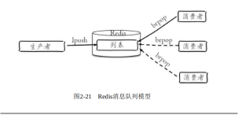


### 2.5 set(集合)

#### 2.5.1 定义

> 集合内的元素不能重复，且无序

#### 2.5.2 内部编码

- **intset（整数集合）**

  > 当集合中的元素都是整数且元素个数小于setmax-intset-entries配置（默认512个）时，Redis会选用intset来作为集合的内部实现，从而减少内存的使用

- **hashtable（哈希表）**

  > 当集合类型无法满足intset的条件时，Redis会使用hashtable作为集合的内部实现。

#### 2.5.3 常用命令

- **sadd key ele [ele ...]**

  > 新添加集合
  >
  > o(n) n 是元素的数量

- **srem key ele [ele ...]**

  > 从集合从删除指定元素
  >
  > o(n) n是元素的数量

- **scard key**

  > 统计集合元素的数量
  >
  > o(1)  

- **sismember key ele**

  > 判断元素是否在集合中
  >
  > o(1)

- **srandmember key [count]**

  > 随机从集合中返回指定数量的值
  >
  > o(n) n是count的数量

- **spop key**

  > 随机从集合中弹出一个值
  >
  > o(1)

- **sinter key [key ...]  or sinterstore key [key ...]**

  > 取多个集合交集
  >
  > o(m*k) k是多个集合中元素最少的个数，m是键个数

- **suion key [key ...]  or suionstore key [key ...]**

  > 取多个集合的并集
  >
  > o(k) k是多个集合元素之和

- **sdiff key [key ...]  or sdiffstore key [key ...]**

  > 求第一个集合和之后多个集合的差集
  >
  > o(k) k是多个集合元素之和

#### 2.5.4 使用场景

- 随机抽取，使用spop 或者srandmember
- 进行标签交换，sinter

### 2.6 zset( 有序集合)

#### 2.6.1 定义

> 有序集合是每个元素都带有score，且每个元素不能重复，但是score可以一样

#### 2.6.2 内部编码

- **ziplist**（压缩列表）：

  > 当有序集合的元素个数小于zset-max-ziplistentries配置（默认128个），同时每个元素的值都小于zset-max-ziplistvalue配置（默认64字节）时，Redis会用ziplist来作为有序集合的内部实现，ziplist可以有效减少内存的使用。

- **skiplist**（跳跃表）：

  > 当ziplist条件不满足时，有序集合会使用skiplist作为内部实现，因为此时ziplist的读写效率会下降。

#### 2.6.3 常用命令

- **zadd key [NX|XX] [CH] [INCR] score member [score member ...]**

  > **添加一个或多个元素到 ZSET**，如果元素已存在，则更新其分数。
  >
  > 支持选项：
  >
  > `NX`：仅添加新元素（忽略已存在的元素）。
  >
  > `XX`：仅更新已存在的元素（忽略新元素）。
  >
  > `CH`：返回值包含新增和更新的元素数量（默认只返回新增数量）。
  >
  > `INCR`：对已存在的元素的分数进行增量操作（类似 `ZINCRBY`）
  >
  > o(k*log(n)), k是添加成员的个数，n是当前有序集合成员个数

- **zcard key**

  >获取元素数量
  >
  >o(1)

- **zscore key member**

  >获取指定成员的score
  >
  >o(1)

- **zrank key member**

  > 获取指定成员在集合中的排名，按分数升序
  >
  > o(log(n)) n是集合元素个数

- **zrevrank key member**

  > 获取指定成员在集合中的排名，按分数降序
  >
  > o(log(n)) n是集合元素个数

- **zrem key member [member ...]**

  >批量删除zset中的指定成员
  >
  >o(k*log(n)) k是删除成员个数，n是集合元素数量

- **zincrby key increment member**

  > 对ZSET中指定成员分数进行增量操作  
  >
  > 成员不存在则新添加元素
  >
  > 示例 zincrby test 5 B
  >
  > o(log(n)) n是集合元素个数

- **zrange key start  end [withscores]**

  > 获取指定索引区间的元素，按分数升序
  >
  > withsocres: 是否一起获取分数
  >
  > o(log(n) + k) k是要获取的成员个数，n是集合元素数量

- **zrevrange key start end [withscores]**

  >获取指定索引区间的元素，按分数降序
  >
  >withsocres: 是否一起获取分数
  >
  >o(log(n) + k) k是要获取的成员个数，n是集合元素数量

- **zrangebyscore key min max [withsocres]**

  - **按分数范围查询元素**，支持分页。
  - 参数：
    - `min` 和 `max`：分数范围（支持 `(min` 表示不包含边界）。
    - `WITHSCORES`：返回分数。
    - `LIMIT offset count`：分页参数。
  - o(log(n) + k) k是返回元素个数，n是集合元素数量

- **ZCOUNT key min max**

  > 统计在指定范围内的元素个数
  >
  > o(log(n)) n是集合元素个数

- **zremrangebyrank key start end**

  > 删除在指定排名内的元素，按升序排列
  >
  > o(log(n) + k) k是删除元素个数，n是集合元素数量

- **zremrangebyscore key min max**

  > 删除分数在 `[min, max]` 范围内的所有元素
  >
  > o(log(n) + k) k是删除元素个数，n是集合元素数量

- **ZINTERSTORE destination numkeys key [key ...] [WEIGHTS weight [weight ...]] [AGGREGATE SUM|MIN|MAX]**

  - **计算多个有序集合的交集**，并存储到目标键中。
  - **交集规则**：只保留**所有输入集合中都存在的成员**。
  - **分数计算**：默认将交集中成员的分数求和（支持自定义聚合方式）
  - 参数
    - `destination`：目标键名，用于存储交集结果。
    - `numkeys`：参与交集运算的有序集合数量。
    - `key [key ...]`：参与交集运算的有序集合键名。
    - `WEIGHTS`（可选）：为每个集合的成员分数指定权重。
    - `AGGREGATE`（可选）：指定分数聚合方式（`SUM`、`MIN`、`MAX`） 默认SUM
  - `o(n*k)+o(m*log(m))`, n是成员数最小的有序集合成员个数，k是有序集合的个数，m是结果集中成员个数

- **ZUNIONSTORE destination numkeys key [key ...] [WEIGHTS weight [weight ...]] [AGGREGATE SUM|MIN|MAX]**

  - **计算多个有序集合的并集**，并存储到目标键中。
  - **并集规则**：包含**所有输入集合中的成员**。
  - **分数计算**：默认将并集中成员的分数求和（支持自定义聚合方式）
  - **参数**
    - `destination`：目标键名，用于存储并集结果。
    - `numkeys`：参与并集运算的有序集合数量。
    - `key [key ...]`：参与并集运算的有序集合键名。
    - `WEIGHTS`（可选）：为每个集合的成员分数指定权重。
    - `AGGREGATE`（可选）：指定分数聚合方式（`SUM`、`MIN`、`MAX`） 默认sum
  - o(n)+o(m*log(m)), n是所有有序集合成员个数和，m是结果集中成员个数

#### 2.6.4 使用场景

- 主要用于排行榜系统

### 2.7 bitmap(位图)

#### 2.7.1 定义

- **Bitmap** 并不是 Redis 的独立数据类型，而是基于 **String 类型** 的位操作实现的。
- 每个位（bit）存储一个布尔值（0 或 1），用于表示二元状态（如“存在/不存在”、“签到/未签到”）。
- 最大容量：**512MB**（对应 232232 个位），支持存储海量二值状态数据。

#### 2.7.2 内部编码

- raw：大于39字节的字符串

#### 2.7.3 常用命令

- **setbit kye offset value**

  > 设置指定offset处的位值为0或1
  >
  > o(1)

- **getbit key offset**

  > 获取指定offset处的位值
  >
  > o(1)

- **bitcount key [start end]**

  > 统计指定范围内值为1的位数
  >
  > o(n) n为范围值

- **bitpos key bit [start end]**

  > 查找第一个值为 Bit 的offset
  >
  > o(n) n为offset 

- **bitop operation destkey key1 [key2 ...]**

  > 对多个 Bitmap 执行位运算（AND/OR/XOR/NOT），结果存储到 `destkey`
  >
  > o(n) n 为最大位数

#### 2.7.4 使用场景

- **二元状态管理**（签到、在线状态、权限）
- **大规模数据统计**（活跃用户、行为分析）
- **布隆过滤器**（缓存穿透防护）

### 2.8 HyperLogLog

#### 2.8.1 定义

> HyperLogLog 是 Redis 提供的一种 概率性数据结构，用于 估算集合中唯一元素的数量（基数）。它通过 哈希算法和概率统计 实现高效的基数统计，核心特点包括：
>
> - 内存占用极低：无论存储多少元素，HyperLogLog 的内存占用始终为 12KB
> - 近似计数：返回值为估算值，误差率为 ±0.81%
> - 常数时间复杂度：添加元素和查询基数的操作时间复杂度均为 O(1)

#### 2.8.2 内部编码

HyperLogLog 的底层实现基于 **概率算法**，其核心思想是通过哈希函数和统计学规律估算唯一元素数量：

1. **哈希映射**：

   - 所有元素通过哈希函数（如 MurmurHash3）转换为 **固定长度的二进制串**（例如 64 位）。
   - 哈希值的分布具有随机性，便于后续统计。

2. **分桶策略**：

   - Redis 将哈希值的高位（前 14 位）作为 **桶索引**，共划分 **2^14 = 16384 个桶**。
   - 每个桶记录该桶中元素的 **最长前导零序列长度**（即哈希值中连续 0 的最大数量）。

3. **基数估算**：

   - 通过所有桶的最长前导零长度的统计，计算最终的基数估算值。

   - 核心公式（简化版）：

     估算值=𝛼𝑚⋅𝑚2∑𝑖=1𝑚2−𝑀𝑖估算值=*α**m*⋅∑*i*=1*m*2−*M**i**m*2

     其中：

     - 𝑚*m* 为桶的数量（16384）。
     - 𝑀𝑖*M**i* 为第 𝑖*i* 个桶的最长前导零长度。
     - 𝛼𝑚*α**m* 为修正系数（用于降低小样本误差）。

4. **线性计数优化**：

   - 如果某些桶为空（未被填充），会采用 **线性计数公式** 修正估算值，避免低估。

#### 2.8.3 常用命令

- **PFADD key element [element ...]**

  > 添加一个或者多个元素
  >
  > o(n) n是添加元素的个数

- **PFCOUNT key [key ...]**

  > 获取HyperLogLog 的估算基数

- **PFMERGE destkey sourcekey [sourcekey ...]**

  > 合并多个HyperLogLog到destkey 

#### 2.8.4 使用场景

1. **大规模数据去重统计**：
   - **网站 UV（独立访客）统计**：统计每日、每小时的独立用户访问量。
   - **IP 去重**：统计访问网站的不同 IP 数量。
   - **广告点击追踪**：估算不同用户点击广告的次数。
2. **实时数据分析**：
   - **社交媒体参与度**：统计某个话题下参与讨论的独立用户数。
   - **日志分析**：从海量日志中提取唯一标识符（如用户 ID、设备 ID）的数量。
3. **多源数据合并**：
   - 通过 `PFMERGE` 合并多个 HyperLogLog 实例，统计跨业务线的总用户数。
4. **资源敏感型场景**：
   - 当需要处理 **亿级数据**，但内存资源有限时（如 Redis 内存约束场景）


### 2.9 GEO

#### 2.9.1 定义

##### **1.1 什么是 GEO？**

- **GEO** 是 Redis 提供的地理空间数据结构，用于存储和查询地理位置信息（如经度、纬度），支持 **距离计算**、**范围查询** 等操作。
- 核心特点：
  - **高效性**：基于 ZSET 和 Geohash 编码，支持快速查询和排序。
  - **简洁性**：通过命令操作即可实现复杂的地理空间功能
  - **适用性**：广泛应用于 LBS（基于位置的服务）场景，如“附近的人”、地理围栏、物流调度等

##### **1.2 底层实现**

- 数据结构：GEO 数据存储在Sorted Set（ZSET）中：
  - **成员（member）**：地理位置的名称（如城市名、用户ID）
  - **分值（score）**：通过 **Geohash 编码** 将经纬度转换为一维数值
- Geohash 编码：
  - **核心思想**：将二维的经纬度坐标通过 **二进制交替切割** 转换为一维数值
  - 编码过程：
    1. **二分法划分**：对经度和纬度交替进行二分区间划分，生成二进制位串
    2. **交替合并**：将经度和纬度的二进制位交错合并，形成最终的二进制串
    3. **Base32 编码**：将二进制串转换为 Base32 字符串（32 个字符：0-9、b-z 去掉 a/i/l/o），便于存储和传输
  - **特性**：相邻地理位置的 Geohash 值相近，支持高效范围查询

#### 2.9.2 内部编码

#### 2.9.3 常用命令

- **GEOADD key longitude latitude member [longitude latitude member ...]**

  > - 将经纬度对应的地理位置添加到 ZSET 中
  >
  > - 参数
  >
  >   - key 键名
  >   - longitude 经度
  >   - latitude 维度
  >   - member 成员
  >
  > - 示例:
  >
  >   ```bash
  >   GEOADD cities 116.405285 39.904989 "北京" 121.474490 31.230416 "上海"
  >   ```

- **GEOPOS key member [member ...]**

  > 获取一个或者多个成员的经纬度

- **GEODIST key member1 member2 [unit]**

  > 计算两个位置的距离，支持单位（米、公里、英里、英尺）
  >
  > 支持单位（米、公里、英里、英尺）

- **GEORADIUS key longitude latitude radius unit [WITHDIST] [WITHHASH] [COUNT count]**

  > 查询指定半径内的所有地理位置

- **GEORADIUSBYMEMBER key member radius unit [WITHDIST] [WITHHASH] [COUNT count]**

  > 查询某个成员所在位置的指定半径内的其他地理位置

- **GEOHASH key member [member ...]**

  > 获取指定成员的 Geohash 编码

#### 2.9.4 使用场景

-  **附近的人/地点搜索**
- **地理围栏**：监控用户是否进入/离开特定区域（如商场、景区）
- **物流与路径规划**：快递公司的配送范围判定、仓库附近的货物调度
- **用户签到与热点分析**：记录用户签到地点，分析热门区域
- **实时定位与导航**：共享单车定位、网约车实时位置更新

#### 2.9.5 优缺点

##### **优点**

- **高性能**：基于 ZSET 和 Geohash 编码，查询复杂度为 `O(log N)`。
- **低内存占用**：Geohash 编码紧凑，适合存储海量地理位置数据。
- **易用性**：提供丰富的命令，无需复杂 SQL 查询。

##### **缺点**

- **精度限制**：Geohash 精度随编码长度增加而提高，但无法达到毫米级。
- **复杂查询支持有限**：不支持非圆形范围（如多边形）查询。
- **大规模数据性能瓶颈**：数百万级数据时需考虑 Redis 集群分片

## 三 、键管理

### 3.1 单个键管理

- **rename key newkey**

  > 修改键名

- **randomkey**  

  > 随机返回一个key

- **expire expireate** 

  > 设置过期时间，单位：expire（s）expireate（ms）

- **pexpire pexpireat** 

  > 设置键在timestamp（时间戳）后失效，单位：pexpire(s)，pexpireate（ms）

- **ttl pttl**

  > ttl 查看过期时间，返回s
  >
  > pttl 查看过期时间，返回ms

- **persist**

  > 移除过期时间，使其永久不过期

### 3.2 迁移单个键

- **同一个redis**

  move key DB

- **不同redis**

  - **`DUMP` + `RESTORE`**
    - 先使用dump key 返回RDB序列化数据
    - 在使用`RESTORE mykey <TTL> <serialized_value> [REPLACE]` 导入键

  - **使用 `MIGRATE` 命令**

    > `MIGRATE` 是 Redis 提供的原子性操作命令，用于将单个键从源实例迁移到目标实例。它结合了 `DUMP`、`RESTORE` 和 `DEL` 的功能，操作简单且高效
    >
    > ```
    > MIGRATE <host> <port> <key> <destination-db> <timeout> [COPY] [REPLACE]
    > ```

    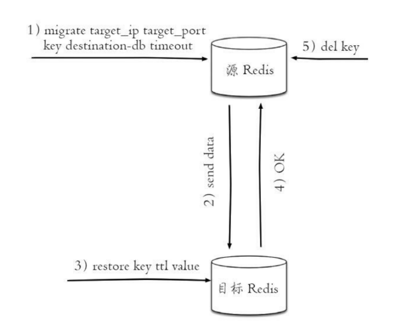

  

  

### 3.3 遍历键

- **keys pattern** 

  >通过正则匹配遍历整个数据库的键名

  - **优点**：
    - 简单直观，一次性返回所有匹配的键。
    - 适合小规模数据库（键数量较少）
  - 缺点：
    - **阻塞操作**：时间复杂度为o(n)，会遍历整个数据库，可能导致 Redis 服务器阻塞，影响性能

- **scran cursor [MATCH pattern] [COUNT count]**

  - **参数**:
    - cursor：游标第一次遍历为0，后续使用返回的游标
    - pattern：正则匹配（可选）
    - count：每次返回的键数量（默认 10，可调整）
  - **优点**:
    - **非阻塞**：分批次迭代键集合，避免一次性加载所有数据。
    - **适合大规模数据**：不会导致 Redis 阻塞
    - **支持模式匹配**：可筛选特定模式的键
  - **缺点**:
    - **可能重复或遗漏键**：由于 Redis 是实时系统，遍历过程中键可能被删除或新增
    - **需手动处理游标**：需要循环调用直到游标为 `0`

### 3.4 过期key处理

> Redis 对过期 key 的处理策略主要通过 **惰性删除**、**定期删除** 和 **内存淘汰策略** 三者结合实现，旨在平衡内存释放效率与系统性能

- **过期key删除三种方式**

  - 定时删除：

    > 在设置过期时间的时候，就给添加一个定时器，到了时间就删除，
    >
    > 删除非常及时，提高了内存利用效率，但是会加CPU利用率 不推荐使用

  - 惰性删除

    > 不主动删除，当访问的时候才会删除，节省了cpu资源开销，但是内存中过期的key不能及时释放

  - 定期删除

    > Redis 每隔一段时间（默认每 100ms）执行一次定时任务，随机检查部分 key

    **处理逻辑**：

    1. **随机抽样**：从设置了过期时间的 key 中随机选取一定数量（默认 20 个）。
    2. **删除过期 key**：对抽样的 key 检查 TTL，若已过期则删除。
    3. **重复扫描**：如果删除的 key 占比较高（如超过 25%），会重复扫描，直到过期 key 比例下降

    **优点**：

    - 以通过限制删除操作执行的时长和频率来减少删除操作对 CPU 的影响。

    -  定期删除，也能有效释放过期键占用的内存。

    **缺点**：

    - 难以确定删除频率，频率太高消耗cpu资源，频率太低，起不到节省内存的效果，
    - 并且过期可以在定时间隔中没有被删除，是可以被访问的。

- **内存淘汰策略**

  > 当 Redis 内存达到 `maxmemory` 阈值时，会根据配置的淘汰策略删除 key，包括过期 key 和未过期 key
  >
  > ```
  > # 通过 redis.conf 配置
  > maxmemory-policy volatile-ttl
  > 
  > # 动态修改
  > CONFIG SET maxmemory-policy volatile-ttl
  > ```

  **常见策略**

  | **策略名称**        | **适用范围**     | **处理逻辑**                                             |
  | ------------------- | ---------------- | -------------------------------------------------------- |
  | **no-eviction**     | 所有 key         | 不删除任何 key，写操作直接报错（默认策略）。             |
  | **allkeys-lru**     | 所有 key         | 删除最近最少使用的 key（LRU）。                          |
  | **allkeys-random**  | 所有 key         | 随机删除 key。                                           |
  | **volatile-lru**    | 带过期时间的 key | 从过期 key 中删除最近最少使用的 key。                    |
  | **volatile-random** | 带过期时间的 key | 从过期 key 中随机删除。                                  |
  | **volatile-ttl**    | 带过期时间的 key | 优先删除剩余时间（TTL）最短的 key。                      |
  | **allkeys-lfu**     | 所有 key         | 删除使用频率最低的 key（LFU，Redis 4.0+）。              |
  | **volatile-lfu**    | 带过期时间的 key | 从过期 key 中删除使用频率最低的 key（LFU，Redis 4.0+）。 |

## 四、复制

### 4.1 现代分布式系统的理论基石——CAP 原理：

> C - Consistent ，一致性
>
> A - Availability ，可用性
>
> P - Partition tolerance ，分区容忍性
>
> 分布式系统的节点往往都是分布在不同的机器上进行网络隔离开的，这意味着必然会有网络断开的风险，这个网络断开的场景的专业词汇叫着「网络分区」。
>
> 在网络分区发生时，两个分布式节点之间无法进行通信，我们对一个节点进行的修改操作将无法同步到另外一个节点，所以数据的「一致性」将无法满足，因为两个分布式节点的数据不再保持一致。除非我们牺牲「可用性」，也就是暂停分布式节点服务，在网络分区发生时，不再提供修改数据的功能，直到网络状况完全恢复正常再继续对外提供服务。
>
> 一句话概括 CAP 原理就是——网络分区发生时，一致性和可用性两难全

### 4.1 什么是主从复制？

> redis主从复制是指一主节点可以将数据同步到一个或者多个从节点，主节点复制写，从节点复制读

### 4.2 主从复制好处

1. 数据冗余：从节点也保存了数据，保证了数据
2. 提高了故障的恢复数据：主节点出问题了，可以快速切换到从节点
3. 提高了读写速率：读写分离，主节点复制写，从节点负责读
4. 高可用的基石：redis的哨兵模式和集群模式都是基于主从复制

### 4.3 数据同步方式

#### 4.3.1 全量复制

> 用于主从节点第一次连接数据复制，如果数据较大，对主从节点造成较大的网络开销

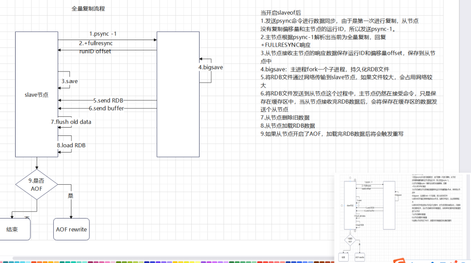

#### 4.3.2 部分复制

> 用于主从复制过程中，网路导致复制中断后，主从节点重新连接后的复制。避免全量复制的资源开销
>
> 主节点维护 `replication backlog`（[复制积压缓冲区]。从节点请求增量数据。主节点返回缓冲区中的未同步数据，避免全量复制

- psync 复制需要一些组件：

  1.主从节点各自复制的偏移量

  2.主节点复制积压缓存区

  3.主节点的运行id

- 复制偏移量：

  > 主从节点会各自维护一个自己的offset偏移量，每次主节点同步给从节点N个数据后，主节点将自己的offset会加N，从节点也会将修改自己offset+N。offset用于判断主从节点的数据库状态是否一致： 如果二者offset相同，则一致； 如果offset不同，则不一致，此时可以根据两个offset找出从节点缺少的那部分数据

- 主节点复制积压缓存区：

  > 主节点会维护一个固定长度的队列，当主节点有写的操作时候，会把写的命令传给从节点，还好把他写入缓存区。可以用来保存已经复制的命令，可以用来部分复制和复制命令丢失的数据。由于缓存区是固定长度的队列，只能保存最近写的命令，当主从节点的offset超过缓存区的长度只能通过全量复制同步数据了

- 主节点运行ID：

  > redis会给每个节点分配一个节点ID，当redis重启后会重新分配，是为了防止主节点重启后重新导入了数据，继续部分复制导致不安全的问题


### 4.4 主从复制

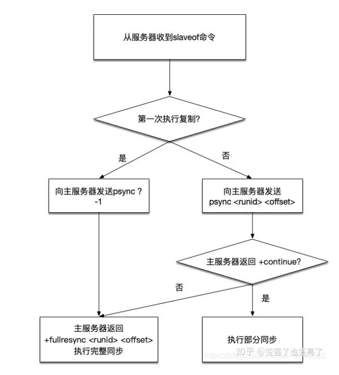


### 4.5 主从心跳检测

> 主从节点在建立复制后，它们之间维护着长连接并彼此发送心跳命令

1. 主从节点都维持的有心跳检测，主节点的连接状态为flags=M，从节点连接状态为flags=S
2. 主节点默认每隔10秒对从节点发送ping命令，判断从节点的存活性和连接状态。可通过参数repl-ping-slave-period控制发送频率
3. 从节点在主线程中每隔1秒发送replconf ack{offset}命令，给主节点上报自身当前的复制偏移量。replconf命令主要作用如下：
   - 实时监测主从节点的网络状态
   - 实时检查主从节点的偏移量，当偏移量不一样的时候同步数据，保存数据的一致性
   - 实现保证从节点的数量和延迟性功能，通过min-slaves-to-write、
   - min-slaves-max-lag参数配置定义
   - 当从节点超过了默认的相应时间后，会下线从节点，但从节点上线后会恢复从节点的心跳监测

### 4.6 异步复制

1. 主节点完成命令
2. 主节点返回结果
3. 主节点异步发送给从节点，从节点在主线程中完成复制会导致一定延迟，主从数据不一致

### 4.7 主从复制的问题

1. 读写分离数据不一致的问题，主节点的数据同步到子节点时会有一定的延迟，不可避免。如果业务可以接受就忽略，不能接受业务要求很高就只能提升主库性能了

2. 读到过期key：3.2以后会判断key的过期时间，已经解决了，主从过期key处理策略，从库不会主动删除过期key，只有主库删除后，会发送del 命令才会删除key

3. 从节点故障问题：对于从节点的故障问题，需要在客户端维护可用从节点列表，当从节点故障时立刻切换到其他从节点或主节点上。这个过程类似上文提到

   的针对延迟过高的监控处理，需要开发人员改造客户端类库


## 五、redis一些小功能点

### 5.1 慢查询

-  **概念**

> 慢查询是统计命令执行耗时，通过**slowlog-log-slower-than**和**slowlog-max-len**配置。

- **参数**:
  - **slowlog-log-slower-than=0** 会保存所有查询，**slowlog-log-slower-than<0** 所有的都不会记录
  - **slowlog-log-slower-than=1000** 单位微秒，设置超过多少算慢查询
  - **slowlog-max-len** 设置保存命令个数，**固定长度队列，先进先出**

- **慢查询命令**：

  - slowlog get [count]： 查询慢查询日志

    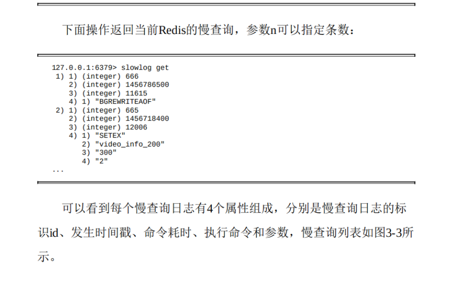

  - slowlog len: 获取当前长度

  - slowlog reset：清空日志重写

- **优缺点**

  | **优点**                   | **缺点**                         |
  | -------------------------- | -------------------------------- |
  | 快速定位慢命令，优化性能   | 增加微秒级延迟，影响高频命令性能 |
  | 支持动态监控和历史日志分析 | 内存占用，需手动管理日志         |
  | 灵活配置阈值和日志长度     | 无法记录资源争用等其他指标       |
  | 简单易用，无需额外工具     | 默认不记录客户端信息             |


### 5.2 pipeline（管道）

- **概念**

  > redis支持批量提交命令，服务端依然是依次执行，减少网络交互，但是要注意管道不是原子，太多命令会阻塞其它命令

- **示例**

  ```python
  import redis
  
  # 创建 Redis 连接
  r = redis.Redis(host='localhost', port=6379, db=0)
  
  # 创建管道对象（默认不开启事务）
  pipe = r.pipeline()
  
  # 添加多个命令到管道
  pipe.set('key1', 'value1')       # 设置键值对
  pipe.get('key1')                 # 获取键值
  pipe.incr('counter')             # 自增操作
  
  # 执行管道并获取结果
  results = pipe.execute()
  # 输出结果
  print(results)  # [True, b'value1', 1]
  ```

  

### 5.3 事务

- **概念**

  > redis通过使用multi 和exec 控制事务，是原子性，但是不支持回滚

- **核心命令**

  | **MULTI**   | 开启事务模式，后续命令会被缓存到事务队列中。                 |
  | ----------- | ------------------------------------------------------------ |
  | **EXEC**    | 提交事务，执行事务队列中的所有命令。                         |
  | **DISCARD** | 取消事务，清空事务队列并退出事务模式。                       |
  | **WATCH**   | 监控一个或多个键的变化，若在事务执行前键被修改，则事务中止（乐观锁）。 |
  | **UNWATCH** | 取消对所有键的监控。                                         |

- **示例**

  ```bash
  MULTI
  SET user:1001 "张三"
  INCR user:1001:score
  EXEC
  ```

- **Redis 事务的 ACID 特性分析**

  | **特性**        | **Redis 实现情况**                                           |
  | --------------- | ------------------------------------------------------------ |
  | **原子性（A）** | Redis 事务中的命令 **按顺序执行**，但 **不支持回滚**。如果某个命令失败，后续命令仍会继续执行。 |
  | **一致性（C）** | Redis 保证事务执行前后数据的一致性（如类型校验），但 **不保证业务逻辑的一致性**。例如，转账操作中，扣钱和加钱可能因部分命令失败导致数据不一致。 |
  | **隔离性（I）** | Redis 是单线程执行的，事务执行期间 **不会被其他客户端中断**，天然具备隔离性。 |
  | **持久性（D）** | 事务的持久性取决于 Redis 的持久化策略（RDB/AOF）。默认情况下，事务中的命令 **不会立即持久化**。 |

### 5.4 LUA脚本

....

### 5.5 客户端管理

**链接信息查看**

> client list 可以输出redis客户端连接信息

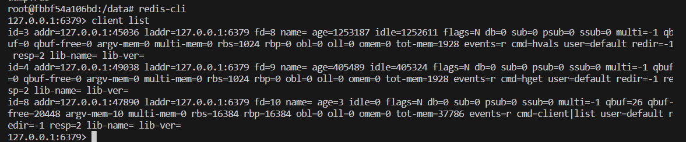

- **输出信息解析**

  

  - id: redis会给每个连接分配一个id，会随着连接数增加自增
  - addr：客户端地址
  - fd：socket文件描述符，当fd=-1表示是内部客户端模仿的客户端
  - name： 客户端名字

- **输入缓存区**

  > 客户端输入到redis的命令都是临时保存在输入缓存区中，redis从缓存区取命令进行执行。

  **参数**：

  - qbuf：输入缓冲区总量

  - qbuf-free：输入缓存区剩余总量

  **注意**：

  > redis 并没有为各个客户端指定输入缓存区的大小，但是输入缓存区不能超过1G，超过了就会被断掉客户端连接。
  >
  > 导致输入缓存区溢出的原因：主要是阻塞操作和bigkeys

- **输出缓存区**

  > reids会把输出结果临时保存到输出缓存区中，然后返回给客户端。输出缓冲区的容量可以通过参数clientoutput-buffer-limit来进行设置，并且输出缓冲区做得更加细致，按照客户端的不同分为三种：普通客户端、发布订阅客户端、slave客户端。
  >
  > 输出缓存区分为两部分: 固定缓存区和动态缓存区，固定缓存区返回给用户较小的结果


### 5.6 持久化机制

#### 5.6.1 RDB

>RDB其实就是把数据以快照的形式保存在磁盘上。什么是快照呢，你可以理解成把当前时刻的数据拍成一张照片保存下来

**三种方式**

- save ：会阻塞到持久化完成，影响其它操作

- bgsave：会异步持久化，不影响其它操作

- 自动持久化：

  > save 900 1 #表示900 秒内如果至少有 1 个 key 的值变化，则保存

- bgsave和自动持久化原理图

  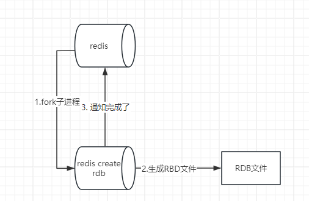

**优缺点**：

- 优点：
  - 备份文件的体积小，节省空间
  - 重写速度快
- 缺点
  - 有时间间隔，中间出问题了，会丢失数据

#### 5.6.2 AOF

**概念**

> 全量备份总是耗时的，有时候我们提供一种更加高效的方式AOF，工作机制很简单，redis会将每一个收到的写命令都通过write函数追加到文件中。通俗的理解就是日志记录。

**AOF重写机制**

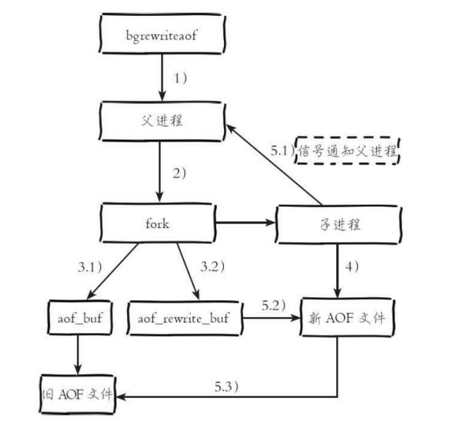

- 1.触发重写机制，有在重写的子进程就直接返回
- 2.如果没有，父进程会fork一个子进程
- 3（1）子进程会继续执行原来的同步策略，将这个时候输入的命令写入AOF缓存区，然后同步到硬盘
- 3（2）由于fork操作运用写时复制技术，子进程只能共享fork操作时的内存数据。由于父进程依然响应命令，Redis使用“AOF重写缓冲区”保存这部分新数据，防止新AOF文件生成期间丢失这部分数据。
- 4.子进程会根据合并规则，重写AOF文件。每次批量写入硬盘数据量由配置aof-rewrite-incremental-fsync控制，默认为32MB，防止单次刷盘数据过多造成硬盘阻塞。
- 5.1 新AOF文件写入完成后，子进程发送信号给父进程，父进程更新统计信息
- 5.2 父进程把AOF重写缓冲区的数据写入到新的AOF文件
- 5.3 用新的AOF文件替换旧的AOF文件

**文件重写原理**

> AOF的方式也同时带来了另一个问题。持久化文件会变的越来越大。为了压缩aof的持久化文件。redis提供了**bgrewriteaof**命令。将内存中的数据以命令的方式保存到临时文件中，同时会fork出一条新进程来将文件重写

**重写模式**

- 每次修改同步，写的操作过的时候，会大量使用CPU，影响主线程性能不好
- 定时同步：比如一秒同步一次，如果redis宕机了，就会丢失瞬时那一部分数据
- 从不同步：不保存数据

**优缺点**：

- **优点**
  - 数据完整性有保证
- **缺点**
  - AOF文件远远大于RDB文件
  - 频繁写，性能没有RDB好

#### 5.6.3 **建议**

> 如果不是数据要求特别高的话，推荐采用**混合持久化** 兼顾性能和安全性

```
appendonly yes
appendfsync everysec  # 平衡性能与安全性
auto-aof-rewrite-percentage 100
auto-aof-rewrite-min-size 64mb

save 900 1
save 300 10
save 60 10000
```


## 六、python客户端操作

### 6.1 **客户端封装**

```python
import redis
from typing import Optional, List, Any, Dict

class RedisClient:
    def __init__(self, host: str = 'localhost', port: int = 6379, db: int = 0, password: Optional[str] = None):
        """
        初始化 Redis 连接
        :param host: Redis 服务器地址
        :param port: Redis 服务器端口
        :param db: 数据库编号
        :param password: 密码（如果启用了认证）
        """
        self._conn = redis.Redis(
            host=host,
            port=port,
            db=db,
            password=password,
            decode_responses=True  # 自动解码字节串为字符串
        )

    def get(self, key: str) -> Optional[str]:
        """获取键的值"""
        return self._conn.get(key)

    def set(self, key: str, value: str, ex: Optional[int] = None):
        """设置键值对，可选设置过期时间（秒）"""
        self._conn.set(key, value, ex=ex)

    def delete(self, *keys: str):
        """删除一个或多个键"""
        self._conn.delete(*keys)

    def exists(self, key: str) -> int:
        """判断键是否存在"""
        return self._conn.exists(key)

    def hset(self, name: str, key: str, value: str):
        """设置哈希字段"""
        self._conn.hset(name, key, value)

    def hget(self, name: str, key: str) -> Optional[str]:
        """获取哈希字段"""
        return self._conn.hget(name, key)

    def pipeline(self, transaction: bool = False):
        """
        获取一个 Pipeline 对象
        :param transaction: 是否启用事务（True 表示开启 MULTI/EXEC 模式）
        :return: Pipeline 对象
        """
        return self._conn.pipeline(transaction=transaction)

    def watch(self, *keys: str):
        """在事务前监视一个或多个键"""
        return self._conn.watch(*keys)

    def unwatch(self):
        """取消所有被监视的键"""
        return self._conn.unwatch()
```

### 6.2 **使用事务**

```python
client = RedisClient()

# 设置初始值
client.set('counter', '0')

# 使用 WATCH 监视 counter 键
with client.pipeline(transaction=True) as pipe:
    client.watch('counter')
    current_value = client.get('counter')  # 非事务读取
    new_value = int(current_value) + 1
    pipe.multi()
    pipe.set('counter', str(new_value))
    pipe.execute()
```

### 6.3 使用管道

```python
client = RedisClient()

# 使用管道批量设置多个键
with client.pipeline(transaction=False) as pipe:
    pipe.set('user:1000:name', 'Alice')
    pipe.set('user:1000:email', 'alice@example.com')
    pipe.expire('user:1000:name', 3600)
    pipe.execute()
```

## 七、一些常用面试题

### 7.1 redis是什么

> redis是key-value的nosql的数据库，优点:读写速度非常快，支持持久化和高可用框架，通常用来做缓存

### 7.2 优缺点

- **优点**
  - 读写速度快，性能好
  - 开源资料丰富
  - 支持持久化和高可用
- **缺点**
  - 特别消耗内存，只能存储小量数据

### 7.3 redis为什么速度很快

- 核心命令的执行仍为单线程，避免资源竞争，减少开销

- 数据存放在内存中，读取效率快

- 支持网络多IO复用，减少阻塞，充分利用CPU，提高并发

  

  


### 7.4 redis可以用来干嘛

- 缓存热点数据
- 计数器 incr decr
- 分布式用户信息保存
- 统计用户登录 , 用户活跃信息 bitmap
- mysql-redis读写分离
- 排名系统（zset）
- 布隆过滤器
- 附近的人，地址查询

### 7.5 redis数据类型


### 7.6 redis持久化机制

> 参考5.6

### 7.7 过期key的处理策略

> 参考 3.4

### 7.8 常见的缓存异常问题或者策略

#### 7.8.1 缓存击穿

- **解释**

> 大并发访问某个key，但是这个key过期了，导致数据库并发激增

- **解决**

  **热点key设置永不过期**

#### 7.8.2 缓存穿透

- **解释**

  > 服务找到恶意访问，大并发访问不存在的数据，直接访问数据，导致数据库并发很高

- **解决**

  > 增加布隆拦截器，通过映射将key都添加到拦截器中，防止恶意访问
  >
  > 增加ip限流，参数校验等操作限制流量

#### 7.8.3 缓存雪崩

- **解释**

  > 缓存雪崩是指大量缓存数据在同一时间过期，或者缓存服务宕机，导致大量请求直接访问数据库，引发数据库压力骤增甚至崩溃

- **解决**

  - **缓存大面积失效**

    > 添加过期时间的时候，设置随机时间，时间粒度更大，防止同一时间过期

  - 缓存服务宕机

    > 搭建高可用服务，哨兵，集群模式

#### 7.8.4 数据不一致

- **解释**

  > 缓存与数据库的数据不一致

- **解决**

  > 对于关键数据不信任缓存数据，访问数据库的数据
  >
  > 使用分布式锁保障一致性操作
  >
  > 异步更新缓存（如通过消息队列），避免同时修改

#### 7.8.5 缓存预热

- **概念**

  > 在用户使用之前将数据添加到缓存服务中

- **使用场景**

  - 秒杀、抢购、大促活动（如双11、618）、限时优惠等
  - 服务重启、新部署、缓存清空后

- **加载策略**

  - 数量不大的时候：程序启动时加载数
  - 数据量大的时候：异步更新数据
  - 数据量很大的时候：上线前提前完成数据加载

#### 7.8.6 缓存降级

- **概念**

  > 缓存降级是**在缓存系统出现故障或资源紧张时，主动牺牲部分非核心功能或数据实时性，以保障系统核心服务的可用性和稳定性**的一种容错策略。其核心目标是通过灵活调整缓存行为，避免因缓存问题导致数据库崩溃或服务整体不可用。

- **目的**

  - **保障核心服务**

    > 当缓存服务（如 Redis）宕机、响应超时或系统资源（CPU/内存）过载时，通过降级避免缓存层成为系统瓶颈，确保核心业务流程（如交易、登录）不受影响。

  - **减少故障影响范围**

    > 通过限制对故障缓存的依赖，防止因缓存问题引发数据库雪崩或服务全面瘫痪

- **触发场景**

  - 缓存服务异常

    > Redis 服务器宕机、网络中断、响应延迟超过阈值。

  - 系统资源紧张

    > 高并发流量下（如秒杀活动），缓存服务器负载过高，需释放资源。

  - 非核心功能影响核心流程

    > 高并发时段需临时关闭非核心模块（如广告推荐、商品详情）以保障订单处理等核心功能

- **方案**

  - **本地缓存降级**

    > Redis 不可用时，尝试使用本地进程内缓存

  - **数据库访问降级**

    > 本地缓存和 Redis 都不可用时，直接访问数据库，但需配合限流、熔断机制

  - **返回默认值或旧数据**

    > 缓存失效或服务异常时，返回预设默认值或旧数据，避免直接访问数据库

  - **灰度降级**

    > 仅对部分用户或请求进行降级，控制影响范围

  - **手动介入降级**

    > 特殊情况下人工关闭缓存，直接访问数据库

- **注意事项**

  - 提前设计降级策略

    > 在代码中实现降级逻辑，并定期测试有效性。

  - 监控与告警

    > 实时监控缓存命中率、响应时间、错误率等指标，及时触发降级。

  - 数据一致性权衡

    > 返回默认值或旧数据可能导致数据不一致，需结合业务场景评估风险。

  - 自动化与人工结合

    > 关键场景（如金融交易）需人工介入，非核心功能可自动化降级。

### 7.9 redis丢失数据

#### 7.9.1 **硬件故障**

- **原因**：服务器宕机、电源故障、硬盘损坏等硬件问题可能导致内存数据丢失。
- **示例**：Redis 依赖内存存储数据，若服务器突然断电且未启用持久化机制，所有数据会丢失。
- **解决办法**：配置持久化策略

#### 7.9.2 操作失误

- **原因**：
  - 手动执行 `FLUSHDB`（清空当前数据库）或 `FLUSHALL`（清空所有数据库）命令。
  - 删除关键键（如误用 `DEL` 命令）。
- **示例**：开发人员调试时误操作清除了生产环境数据。
- **解决办法**：严格限制生产操作命令，并且配置持久化策略

#### 7.9.3 **数据同步问题**

- **原因**：
  - 主从复制时，主节点写入数据后未及时同步到从节点，主节点故障导致数据丢失。
  - Redis 集群中节点故障未及时处理。
- **示例**：主节点写入数据后崩溃，从点未同步该数据。
- **解决方法**：启用主从复制，配置 `min-replicas-to-write`，使用 Redis 集群

#### 7.9.4 **Redis 实例故障**

- **原因**：
  - 单实例部署的 Redis 服务器宕机。
  - 多副本部署中主节点和副本节点同时故障。
- **示例**：数据中心中断导致主从节点同时不可用。
- **解决方法**：使用云服务的冗余部署

### 7.10 redis主从数据丢失

#### 7.10.1 原因

- **异步复制导致的数据丢失**：

  >  当主节点有一部分数据还在缓存中还没来得急给从节点发送数据，master节点就挂掉了，数据会丢失

- **脑裂导致的数据丢失**：

  >  由于网络或者其他原因导致master节点和sentinel集群没有联系上master节点，sentinel会选取新的master节点，同时有两个master节点。但是master节点和客户端还是通的，客户端还在往旧master节点写入数据，当旧的master和sentinel联系恢复后，就会自动转换为从节点，而导致数据丢失

#### 7.10.2 解决办法

> 通过配置 min-slaves-to-write（至少有几个node在线才能写入），min-slaves-max-lag（主从同步不超过这个时间才可以写入）
>
> 以上面配置为例，min-slaves-to-write设置为1，这两个参数表示至少有1个salve的与master的同步复制延迟不能超过10s，一旦所有的slave复制和同步的延迟达到了10s，那么此时master就不会接受任何请求。
>
> 我们可以减小min-slaves-max-lag参数的值，这样就可以避免在发生故障时大量的数据丢失，一旦发现延迟超过了该值就不会往master中写入数据。,


## 八 、redis部署策略

### 8.1 **单个实例**

- **简介**：

  > 最简单的部署方式，所有数据存储在一台服务器上，适用于开发测试或小规模应用。

- **特点**：

  - **优点**：部署简单、维护简单
  - **缺点**：单点故障风险高，性能不好

- 使用场景：

  >对性能和数据没什么要求的场景

### 8.2 主从部署

- **简介**：

  > 数据从主节点（Master）异步复制到多个从节点（Slave），实现读写分离和数据冗余

- **特点**：

  - **优点**：部署简单、维护简单，数据有一定的保证，性能相对单实例有所提高
  - **缺点**：主从切换需要手动，并且代码需要手动切换ip

- 使用场景：

  >对性能和数据有一定要求，但是也不是特别重要的场景

### 8.3 哨兵模式

- **简介**：

  > 在主从复制基础上引入哨兵节点（Sentinel），可以实现故障发现、故障自动转移、配置和客户端通知。Redis Sentinel的节点数量要满足2n+1（n>=1）的奇数个

- **特点**：

  - **优点**：对主从节点进行监控，来完成自动的故障发现与转移
  - **缺点**：
    - 配置复杂
    - 特别是在主从切换的瞬间存在访问瞬断的情况，等待时间比较久，会产生不可用
    - 哨兵模式只有一个主节点对外提供写服务，不像集群可以多个写的节点

- 使用场景：

  >对高可用性要求较高的生产环境

### 8.4 集群模式

- **简介**：

  > Redis Cluster 集群节点最小配置 6 个节点以上(3 主 3 从)，其中主节点提供读写操作，从节点作为备用节点，不提供请求，只作为故障转移使用。Redis Cluster 采用虚拟槽分区，所有的键根据哈希函数映射到 0～16383 个整数槽内，每个节点负责维护一部分槽以及槽所印映射的键值数据

- **特点**：

  - **优点**：
    - 水平扩展（支持多节点横向扩展）。
    - 自动分片和故障转移。
    - 高性能和高可用性。
  - **缺点**：
    - 运维复杂
    - 只能使用0号数据库
    - 需要的资源比较多

- 使用场景：

  >大规模数据存储、高并发访问的场景

### 8.5 一致性hash和hash槽介绍

- **hash**：

  > 相同的输入，得到值一定相同；不同的输入，大概率得到不同的结果。我们把不同的输入得到相同的结果，称为hash碰撞（概率特别小）

- **一致性哈希**：

  **概念**

  > 将所有节点通过hash值结合到一起，分配到一个闭合环上（通常为2^32的范围），第一次分配的时候按节点均分

  **数据定位规则**

  - 对键（Key）计算哈希值，确定其在环上的位置。
  - 沿环顺时针方向查找第一个节点，该节点即为存储该键的节点

  **优点**

  - **数据迁移最小化**：新增或删除节点时，仅需迁移该节点相邻区域的数据，其他数据不受影响。
  - **扩展性**：支持动态增删节点，适合大规模分布式系统。
  - **容错性**：节点故障时，数据可重定向到下一个可用节点

  **缺点**

  - **数据倾斜风险**：如果节点分布不均匀（如节点过少），可能导致某些节点负载过高。
  - **复杂性**：需要维护虚拟节点和哈希环的动态映射，实现复杂度较高

-  **哈希槽**：

  **核心原理**

  - **固定槽位数量**：Redis Cluster 将数据划分为 **16384 个哈希槽**（0~16383），每个槽位对应一个数据分区。
  - **槽位分配**：
    - 所有主节点共同负责这些槽位，初始时槽位均匀分配给主节点。
    - 数据通过 `CRC16(key) % 16384` 计算所属槽位，并由对应的主节点管理。
  - **故障转移与迁移**：
    - 主节点故障时，其从节点接管槽位。
    - 扩容或缩容时，通过手动迁移槽位（如 `CLUSTER SETSLOT` 命令）重新分配负载

  **优点**

  - **灵活的数据控制**：通过显式分配槽位，可精确控制数据分布，避免一致性哈希的随机性问题。
  - **高可用性**：主从架构下，槽位故障可自动转移，保障数据可用性。
  - **简单易用**：Redis Cluster 提供开箱即用的槽位管理工具（如 `redis-cli --cluster`）。

  **缺点**

  - **手动管理槽位**：扩容或缩容时需手动迁移槽位，不如一致性哈希的自动迁移灵活。
  - **槽位冲突风险**：若槽位分配不均（如主节点数量过少），可能导致负载不均衡

## 
